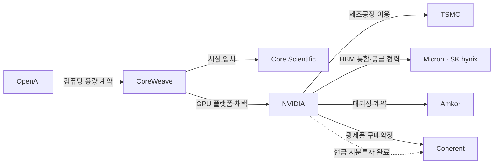

# 반도체 중심 공급망·자금 흐름 연구

기준일: **2026-10-03**. 상태: **`RESEARCH_CANDIDATE_NOT_GOVERNED_EVIDENCE`**.

이 자료는 반도체를 중심으로 AI, 데이터센터, 전력, 소재와 금융의 관계를 구조화한 연구 초안이다. 사용자가 지정한 세 과거 저장소를 정적 검토하고, 최신 조사 결과를 현재 `sk`의 출처·검증 체계와 연결할 준비 자료로 정리했다. 세계 전체 공급망, 실행 중인 수집기, 검증된 선행지표 또는 투자 추천을 뜻하지 않는다.

이번 진행은 **AI 고객의 구매 약정 → 공급자의 자금 조달·집행 → 칩·시설·전력 확보 → 실제 가동·사용 → 매출·현금**에서 공개 확인 가능한 연결과 공백을 찾는 데 목적을 둔다. 첫 질문은 “고객 구매 약정으로부터 공급자의 실제 실현을 공개 자료로 어디까지 연결할 수 있는가?”이며, 첫 수집·검토 후보는 SEC의 2025-09-23 OpenAI–CoreWeave 추가 주문서 관련 공시 한 건이다. 단일 계약의 공개 추적 가능성 실험이며 선행성 검증이 아니다. 2025-09 역사 사건의 점검이며, 2026-10-03 현재 두 회사의 전체 약정·돈흐름 현황은 이 사례의 범위가 아니다.

## 시작할 문서와 데이터

- [경제적 목적과 첫 실험](decision_purpose.md): 경제적 질문·관측 단위·공개 시점·결과 변수·반증·제외 기준을 수집 전에 정한 계획.
- [과거 세 저장소 검토](legacy_reference_review.md): 재사용한 방법론, 실제 구현 한계, 커밋에 고정한 근거.
- [목적별 수집 계획](collection_plan.md): 경제적 질문, 지표, 무료 접근 경로, 연결 키, 후속 확인 결과.
- [연구 자료 manifest](../../../data/research/semiconductor_supply_chain/2026-10-03/manifest.json): 파일 해시, 공개판 변환, 검토 버전과 검증 경계.
- [관계 지도 v3](../../../data/research/semiconductor_supply_chain/2026-10-03/supply_chain_map_v3.json): 주체, 관계, 시설, 계약, 사건과 대표 경로.
- [좌표가 확인된 시설 GeoJSON](../../../data/research/semiconductor_supply_chain/2026-10-03/verified_facilities.geojson): 공식 좌표가 있는 발전소 2곳. 고객 데이터센터 위치가 아니다.
- [32개 후보 지표](../../../data/research/semiconductor_supply_chain/2026-10-03/signal_catalog_v2.json), [14개 우선 수집 지표·로드맵](../../../data/research/semiconductor_supply_chain/2026-10-03/collection_roadmap_v2.json).
- [수집용 증거 구조 제안](../../../data/research/semiconductor_supply_chain/2026-10-03/evidence_schema_v2.json), [출처·방법론 검토](../../../data/research/semiconductor_supply_chain/2026-10-03/source_benchmark_v2.json), [무료 API 접근 계획](../../../data/research/semiconductor_supply_chain/2026-10-03/api_issuance_plan_v3.json).

## 현재 범위

| 대상 | 현재 연구 자료 | 한계 |
| --- | ---: | --- |
| 경제 주체 | 69 | 상장사 외에 운영법인, 차입법인, 규제기관 포함. 전수 목록 아님 |
| 관계 | 58 | 구매·기술협력·투자·금융·모회사·승인 관계를 합친 수. 주문 수가 아님 |
| 시설 | 7 | 미국·대만의 대표 사례. 세계 전체 시설 미포함 |
| 공식 좌표 | 2 | 발전소 위치만. 본사나 인접 고객 DC의 좌표로 대체하지 않음 |
| 대표 경로 | 6 | GPU 제조, 클라우드·금융, AWS 맞춤형 칩·전력, 전력·인허가, 전력소자·광통신, 소재·공정 |
| 수집 정의 | 7 묶음 | 고객 약정, 자금 집행, 칩 공급, 시설 준비, 전력, 소재·연결부품, 이용·증권자금 |
| 후보 지표 | 32 / 우선 14 | 예측력·선행 기간 검증 전 |

관계 58개 중 **17개는 v3 조사에서 출처를 확인·갱신**했고, **41개는 이전 조사에서 이월**했다. `current_turn_reviewed`는 그 차이를 나타내며 사람의 Evidence 승인, 전체 최신성 보증 또는 예측 검증을 뜻하지 않는다. 각 관계의 `intake_status`는 연구 후보다.

## 고객과 판매자는 관계마다 달라진다

실선 화살표는 고객·이용자에서 공급자로 향하고 점선은 지분투자다. 모든 연결에 물량·가격·현금 지급이 공개된 것은 아니다.



| 경로 | 구체적으로 나눈 관계 | 필요한 다음 관측 |
| --- | --- | --- |
| GPU 제조 | NVIDIA/AMD와 파운드리·HBM·패키징·검사 공급자 | 제품 세대, 고객 수용, 양산·출하, 실제 시설 배정 |
| 클라우드·금융 | OpenAI–CoreWeave 고객 약정, Core Scientific 시설 공급, CoreWeave 금융자회사 차입 | 고객 선급금, 대출 인출, 장비 지급, 시설 가동·매출 |
| AWS 맞춤형 칩·전력 | AWS가 Marvell의 칩 고객이고 Marvell은 AWS 클라우드 사용자. Talen 전력과 PPL 전달 역할 분리 | 제품별 양산, 계약 개정, 공급 개시와 실제 전력 |
| 전력·승인 | Microsoft–Constellation 계약과 NRC 절차; Meta의 Laidley/Evest–Entergy 계약과 LPSC 절차 | 승인 조건, 발전·송전 공정, 수전·상업운전 |
| 전력소자·광통신 | Navitas GaN/SiC, Infineon–Eaton SiC 전력 변환, Coherent InP 광통신, Arista–Broadcom 네트워크 | 기술협력→제품 출시→공급→설치. 공급사 투자와 제품 구매 별도 추적 |
| 소재·공정 | 실리콘 웨이퍼, 가스·CMP, GaN/SiC 전력, InP 광통신, GaAs RF를 기능별 분리 | 국가 무역과 실제 공정 관련성·직접 공급사 연결. 갈륨·희토류의 기업별 배정은 미확인 |

실제 차입자인 `CoreWeave Financing DDTL V-V LLC`, 모회사·보증인 CoreWeave, 주선 은행, 대출 참여자 집합은 별도 주체다. 약정액은 인출액이 아니며 주선 은행 각각이 전체 약정액을 대출했다는 뜻도 아니다. NVIDIA의 광제품 구매와 Coherent 지분투자도 다른 관계다. 같은 두 회사의 복수 관계를 자동으로 합치지 않는다.

## 자금과 물리적 실현을 분리

```text
고객 관심·신청 → 조건부 약정 → 계약·발효
자금: 예산 → 투자/대출 약정 → 현금 수령/인출 → 설비 지급
시설: 허가 신청 → 조건부 승인 → 착공 → 설치 → 수전 → 가동
이용: 계약 용량 → 청구 용량 → 실제 부하/에너지 → 이용·매출
```

이것은 관측 위치를 구분하는 도식이다. 모든 사업이 같은 순서로 진행되거나 앞 사건이 뒤 사건을 일으켰다는 증거가 아니다. 계약 MW, 시설 명판 MW, 실제 부하 MW, 에너지 MWh를 합치지 않는다. ETF 보유 비중 변화, 기업이 받은 투자금, 기업의 설비 지급도 각각 다른 자금 흐름이다.

시설은 Amkor Arizona, ASE Nanzih III, Crane, Susquehanna, Laidley 초기 Hyperion, Evest 인접 확장, Coherent Sherman InP 확장이다. Crane은 EIA의 `Operating` 시트에 있어도 원 상태가 `(OS) Out of service`다. Susquehanna의 두 발전기는 `(OP) Operating`이다. GeoJSON은 이 원 상태와 발전소 좌표의 범위를 보존하며, 특정 고객의 실제 사용량은 `null`로 둔다.

## 기존 검증 체계와 연결하는 방법

1. 연구 자료에서 후보 주장과 원출처를 찾는다. URL·요약은 후보 탐색 정보다.
2. 원문, 발췌, locator, 발행/이용가능 시점, 내용 hash를 갖춘 Source와 Atomic Evidence를 만든다.
3. 출처 종류, 경제적 사건 상태, 주장/검토 상태를 별도 필드로 검토한다. 회사 발표·외부 추정·모델 계산은 서로 다르다.
4. 기존 Evidence Governance Harness와 적용되는 사람 검토를 통과한 기록만 정식 Evidence로 사용할 수 있다.
5. H1 경험 검증 편입은 동결된 Track·기간·역할·단위·결과 정의와 Gate 6 결정에 따른다.

이 공개판은 기존 [Atomic Evidence 계약](../../../02_SCHEMAS/atomic_evidence.schema.json)과 [Graph 계약](../../../02_SCHEMAS/graph_edge.schema.json)을 대체하지 않는다. 제안된 `evidence_schema_v2.json`은 수집 설계이며 runtime에 연결된 승인 스키마가 아니다. 사건의 `stage_raw`를 보존하고 `normalized_stage=null`, `normalization_status=NOT_MAPPED_TO_GOVERNED_TAXONOMY`로 두었다. 사건 ID는 날짜를 파싱하는 키가 아니라 불투명 식별자다. 사건일, 서면 발행일, 관측 월과 목표일을 각각 사용한다.

기존 H1의 제품 상용화와 플랫폼 실현 층은 분리한다. 이 자료로 24-Track을 자동 추가·교체하거나 Gate 6를 승인하지 않는다. H1 lead/lag·실현율·신호 순위·verdict는 계산하지 않았고 H2/H3, 판단 엔진, 대시보드나 데이터베이스를 활성화하지 않았다.

연구 통합 또는 최소 수집 경로의 `main` 병합은 저장소 통합이며, Gate 6 동결·Strong Inference·정식 Evidence 승인이나 경제적 결론을 뜻하지 않는다. `known_at`은 주장 공개 시점으로 사건일·수집 시각과 구분하며, 공개된 정밀도만 저장한다. ETF의 투자자 배분을 기업의 자금 수취·설비 지급으로 해석하지 않는다.

## 공개판과 검증

원본 연구 출력은 파일 hash로 추적하고 공개판의 변환을 manifest에 기록했다. 사용자별 키 보유·활성화·인증 상태와 로컬 경로는 제거했다. Private 참고 저장소의 원코드·개인 자료·원문 응답 파일을 복사하지 않았으며, 기관 보고서 원문이나 내려받은 XLSX도 배포하지 않는다. `baseline_snapshot.research_input_label`과 `eia_point_check.source_file_label`은 과거 입력의 이름이고 공개 bundle의 파일 경로가 아니다. EIA 원본은 공식 URL로 안내한다. 지표의 `research_origin_group`은 조사 묶음이며 파일 참조가 아니다.

저장소 루트에서:

```bash
python scripts/validate_supply_chain_research.py
python -m unittest -v
```

첫 명령은 JSON 파싱, manifest 해시·크기, ID·참조, 후보 상태, 개인정보 패턴, 좌표·원 상태와 수집 목록의 일치를 검사한다. API 호출 성공, 모든 URL의 현행성, 주장 내용의 정확성, 예측력이나 사람 승인을 검증하지 않는다. 회귀 검사는 잘못된 고객 연결, 미검증 좌표, 예측 검증으로의 자동 승격, 사용자별 접근 정보 및 발전기 상태 손실을 거부하는지 확인한다.

출처 archive와 이 연구 bundle은 `.gitattributes`에서 줄바꿈 자동 변환을 제외한다. Windows checkout도 저장소에 기록된 바이트를 유지하므로 기존 source hash와 공개판 manifest를 재현할 수 있다. 원문 내용이나 기준 해시를 변경하여 오류를 숨기지 않는다.

## 단일 고객 약정 수집·재검사

[수집기](../../../scripts/collect_customer_commitment.py)는 SEC와 회사 제공 원문을 명시적으로 선택하며 자동 fallback하지 않는다. [사례 검토](first_case_review.md)는 계약의 직접 근거, 회사 전체 배경, 공개 연결 미확인을 구분한다. [후보 기록](../../../data/research/customer_commitments/coreweave_openai_20250923/record.json)과 [수집 manifest](../../../data/research/customer_commitments/coreweave_openai_20250923/acquisition.json)에 실제 source role·URL·hash·locator와 일자를 저장한다.

```bash
python scripts/collect_customer_commitment.py --source issuer
python scripts/collect_customer_commitment.py --verify-only
```

회사 공식 IR의 공개·무키 feed와 HTML이 이번 수집 경로다. SEC 직접 요청은 HTTP 403 실패로 별도 보존하며 회사 원문을 SEC 원본 바이트로 표시하지 않는다. SEC 경로는 식별 가능한 `SEC_USER_AGENT` 또는 `--user-agent`가 필요하고 이 값은 저장하지 않는다. `--source-dir`는 실제 SEC HTML 두 개, `--issuer-source-dir`는 실제 회사 HTML·feed의 오프라인 import다. 오프라인 import는 원격 접근 성공을 주장하지 않는다.

같은 source hash·parser version의 capture는 중복 생성하지 않고 바뀐 버전은 이력으로 보존한다. `--verify-only`는 raw hash와 원문 추출을 재검사한다. 합성 회귀 검사를 실자료 수집·예측 검증으로 해석하지 않는다. API 계정·키 발급, 연속 수집, H1 편입은 실행하지 않았다.

**다음 작업 하나:** 같은 주문서와 직접 연결되는 후속 공시 한 건에서 서비스 개시 또는 실제 현금 수취의 공개 여부를 확인한다.
