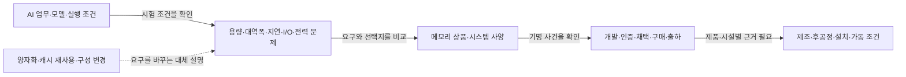

# AI 기술 변화와 하이닉스 상품 수요의 연결

조사일: **2026-10-04**. 상태: **`RESEARCH_CANDIDATE_NOT_GOVERNED_EVIDENCE`**.

이 문서는 AI 기술·사용 방식의 변화가 어떤 시스템 문제를 만들고, 그 문제가 HBM·호스트 DRAM·SSD의 요구와 고객 채택·공급 조건으로 어떻게 연결되는지 정리한다. 목적은 하이닉스의 **영업·마케팅·상품기획·신제품사업화** 학습이다. [산업 거시 구조](semiconductor_macro_structure.md), [지표 수집 계약](memory_cycle_signal_plan.md), [GB300 고객·상품 카드](customer_product_cards/hbm_nvidia_gb300.md)와 [첫 분기 관측표](memory_observation_panel_2026q2.md)를 함께 사용한다.

현재 마련한 것은 조사 관계와 대표 근거다. 각 기술 변화가 업계 총수요·특정 고객 주문을 얼마나 늘렸는지 측정한 결과는 아니다. 공개되지 않은 물량·가격·수율·시설 배정을 채우지 않는다. 오래된 기술 설명·인증 사건과 현재 자료의 기준일도 보존한다.

## 기술 변화에서 고객과 공급 조건까지

화살표는 **우리가 조사할 관계**다. 모든 거래의 순서·인과를 확인한 그림이 아니다. 샘플·인증·전시 탑재·주문·양산·상업 출하는 각각의 사건으로 보존한다. 기술 설명, 공급사 주장, 시험 결과와 우리의 가설을 각 행에서 구분한다.

HBM은 GPU 등에 가까운 DRAM 계층, 호스트 DRAM은 CPU 시스템 메모리, SSD는 저장장치다. 호스트 메모리가 항상 DDR5인 것은 아니다. 기존 GB300 NVL72 자료의 CPU 메모리는 LPDDR5X이고 Intel Xeon 6용 DDR5 RDIMM 인증은 다른 플랫폼 사례다. **SRC-HBM-NV-PRODUCT / SRC-HY26-INTEL**. Gb/GB, 다이/모듈/시스템, NAND 칩/완성 SSD, 최대/선택/실제 탑재를 구분한다.

## 대표 연결 일곱 가지

| 연결·업무 조건 | 병목과 상품 요구 | 공개 근거와 채택·공급 공백 |
| --- | --- | --- |
| **AIL01 학습과 추론의 구분**. 같은 모델 이름이어도 학습의 순전파·역전파와 추론의 실행 단계가 다름 | **기술 설명:** 실행 단계·모델·정밀도·배치별 자원 요구를 비교해야 함. **조사 가설:** GPU 메모리 용량·대역폭 요구를 HBM 사양과 연결해 확인 | **SRC-AI-SW-NV-INFERENCE**는 기술 배경. GB300의 하이닉스 HBM3E 적용 발표는 기존 카드의 별도 사건. 해당 전시의 고객 학습 업무·주문량·HBM 배정은 미확인 |
| **AIL02 추론의 입력 처리와 토큰 생성**. prefill·decode, 입력/출력 길이·동시성·지연 목표를 나눔 | **기술 설명:** 단계와 배치에 따라 계산·메모리 접근의 제약이 달라짐. **조사 가설:** 같은 GPU에서도 HBM 용량·대역폭·요청 처리 목표의 선택이 달라질 수 있음 | **SRC-AI-SW-NV-INFERENCE**. decode를 모든 구성에서 메모리 병목이라고 고정하지 않음. 시험 TPS·지연을 하이닉스 구매 비트로 환산하지 않음 |
| **AIL03 긴 문맥·다회 추론과 KV 캐시 배치**. 이미 계산한 정보를 어디서 재사용할지 선택 | **회사 기술 설명:** NVIDIA CMX는 HBM·시스템 RAM·SSD와 네트워크 연결 flash 계층을 구분. **조사 가설:** 계층별 용량·대역폭·지연·전력 요구를 별도 상품 질문으로 볼 필요 | **SRC-AITECH-NV-CMX-BLOG26 / PRODUCT**의 아키텍처·파트너 목록. 구체 CMX 구성의 하이닉스/Solidigm SKU·구매·출하·시설 배정은 미확인. CMX의 호스트 RAM을 자동으로 Xeon DDR5와 연결하지 않음 |
| **AIL04 양자화·캐시 재사용·메모리 이동**. 정밀도·공유 가능한 prefix·보관 정책·구현 버전이 달라짐 | **기술 문서:** 지원하는 양자화와 재사용 방식은 구현별 조건이 있음. **반론:** 같은 업무의 메모리 요구·전송·재계산 비용은 소프트웨어로 바뀔 수 있음 | **SRC-AI-SW-TRT-QUANTIZATION / KV-REUSE**. 서로 다른 backend·문서 버전의 기본값을 합치지 않음. 효율 개선이 업계 총수요 감소나 구매 증가를 보장하지 않음 |
| **AIL05 CPU 서버의 시스템 메모리**. 고객 플랫폼의 용량·속도·호환성 요구를 확인 | **상품 사건:** 하이닉스의 32Gb 다이 기반 256GB DDR5 RDIMM에 대한 Intel 인증, Dell R770 전시의 DDR5·PS1010 설치를 각각 확인. **조사 질문:** 실제 업무와 구성의 요구가 무엇인가? | **SRC-HY26-INTEL / DELL**. 인증 주체·전시 시스템과 법적 구매자를 구분. 같은 SKU·같은 거래·실제 AI 업무·대량 출하 여부는 독립 확인 필요 |
| **AIL06 저장 용량·데이터 접근과 eSSD**. 데이터 보관·읽기 패턴과 추론 실행 중 I/O를 구분 | **공급사 고객 설명:** Solidigm–VAST의 고밀도 SSD 활용 사례. **시험 반론:** 다른 시험의 SSD 추가가 모든 추론 성능을 개선한다고 일반화할 수 없음. 용량·I/O·지연·내구성·전력·TCO를 각각 확인 | **SRC-HY26-VAST / SSD-WORKLOAD**. 기명 활용과 공급사 시험의 근거 범위가 다름. SKU·PO·사용량·일반화 가능한 절감률은 미확인. VAST 사례를 CMX 구매 관계로 합치지 않음 |
| **AIL07 HBF의 신규 메모리 계층 제안**. 추론의 용량·대역폭 문제에 새로운 선택지를 제시 | **회사 규격 발표:** 하이닉스·Sandisk의 HBF 첫 규격 공개와 UCIe 기반 연결 방향. **조사 가설:** 향후 고객 플랫폼·규격·검증 조건을 별도 상품 기획 과제로 조사 | 신규 **SRC-AITECH-HBF-FMS26**. 규격·표준화·생태계 사건이며 고객 양산 채택·상업 출하를 뜻하지 않음. HBF를 CMX의 flash와 동일 상품으로 취급하지 않음 |

위 연결은 모두 특정 조건 아래 검토할 설명이다. **현재 고객의 병목을 직접 측정했다는 뜻은 아니다.** 예를 들어 재사용·정밀도 변경·더 많은 기존 장비 활용도 결과를 바꿀 수 있다. 기술의 효율, 시스템당 탑재량, 설치 시스템 수, 최종 사용과 공급사 구매를 따로 확인한다.

원문 시점과 구현도 구분한다. AIL01/02의 추론 설명은 **2023-11-17 기술 배경**이며 학습 전체의 메모리 계산이나 현재 시장 동향 자료가 아니다. TensorRT-LLM 양자화 문서는 **2026-09-26 / commit c76f4a8의 PyTorch backend** 맥락이고, KV 재사용 문서는 **2025-09-15 / commit 0c9430e의 TensorRT Engine/Executor** 맥락이다. 두 구현의 기본값·지원표·요청 완료 후 재사용 조건을 동일한 최신 동작으로 합치지 않는다. CMX 블로그는 **2026-03-16 회사 아키텍처 설명**, HBF는 **2026-08-04 회사 규격 공개 발표**다. 문서에 적힌 기술·표준·계획과 실제 운영·채택 상태를 별도로 확인한다.

## 누가 고객이고 누가 검증하거나 공급하는가

| 역할과 기명 사례 | 확인한 범위 | 다음에 확인할 관계 |
| --- | --- | --- |
| 플랫폼 사양·시스템 설계: NVIDIA | GB300 사양 및 CMX 아키텍처 설명 | 메모리 코드·공급사·요구 고정일·기명 인증과 실제 구매 법인 |
| 플랫폼 인증: Intel | 하이닉스 DDR5의 Xeon 6 인증 완료라는 공급사 발표 | 대상 모듈 코드·지원 구성·OEM 실제 채택. Intel을 모듈 구매자로 넣지 않음 |
| 시스템 통합·판매: Dell·Supermicro | Dell 전시 설치와 Supermicro GB300 NVL72 출하는 별도 사건 | 각 구성의 메모리 공급사·SKU·주문·납기. 두 시스템의 메모리를 합치지 않음 |
| 서비스 제공·활용: AWS·VAST | AWS의 GB300 서비스 제공, VAST의 Solidigm 활용이라는 각각의 발표 | 설치·사용량·고객 업무·직접 구매 여부. 브랜드·사용자를 대금 지급자로 대신하지 않음 |
| 제품 개발·제조: SK hynix·Solidigm; 협력: TSMC·Sandisk | HBM 적용·HBM4 개발 협력, SSD 활용·HBF 규격 발표 | 같은 제품의 공정·패키징·검사·인증·출하와 시설 배정. 개발 협력을 완성된 공급 능력으로 환산하지 않음 |
| 시설·전력·승인 주체 | 기존 거시 구조에 역할과 단위 기준 존재 | 이 표의 플랫폼과 같은 기명 시설의 설치·통전·가동 근거. 현재 연결은 미확인 |

**법적 구매자·지급자·특정 고객의 물량은 근거가 없으면 `KNOWN_UNKNOWN`이다.** 공급사–플랫폼–OEM–클라우드를 하나의 실제 주문 경로로 단정하지 않는다. 위 역할 표는 기존 사례의 범위를 재사용한 것이며 CMX 파트너 목록에 있는 기업이 하이닉스 SSD를 구매했다는 뜻도 아니다.

## 무엇을 왜 무료로 수집할 것인가

새로운 API 개수보다 아래 관측의 정의와 연결 키를 먼저 고정한다. 점검 주기는 **제안**이며 자동 수집을 구현한 상태가 아니다. 공개 페이지 접근 성공과 전체 기록·반복 이용 가능 보장도 구분한다.

| 목적·기존 지표 | 관측 정의·연결 키 | 무료 경로·확인 주기와 한계 |
| --- | --- | --- |
| **MC04 업무·시험 조건**: 요구를 만든 문제 확인 | 모델/버전·학습/추론·prefill/decode·정밀도·입력/출력 길이·동시성·배치·소프트웨어 backend/commit·시스템/SKU. TTFT·토큰 지연·TPS·전력은 같은 시험 조건의 원 단위 | 고객/공급사 기술 문서와 MLCommons 공개 결과. 무료 웹·파일, 무키. 시험/릴리스별 확인 제안. 이번에는 문서 조건만 확보했고 새 MLPerf 결과 행·고객 실측은 미수집 |
| **MC02 플랫폼·상품 요구**: 무엇을 제안할지 확인 | 플랫폼 세대·시스템/모듈/SSD 코드·문서 버전·메모리 계층·용량·대역폭·I/O·전력·폼팩터. 기본/최대/선택/실제 구성 분리 | NVIDIA·Intel·OEM·SK hynix/Solidigm 공식 지원·제품 자료. 무료 웹/PDF, 무키. 개정/발표 때와 월간 변경 확인 제안. 최대 용량×출하 대수를 실제 주문으로 계산하지 않음 |
| **MC03·MC15 인증·채택·공급 준비**: 상업화에 남은 관문 확인 | 상품×플랫폼×법인/역할×사건일×공개일×원 단계×출처 버전. 샘플·인증·전시·양산·상업출하와 패키징·검사 범위 보존 | 공식 공급사/고객 뉴스·IR·인증 목록. 무료 웹/PDF, 무키. 발표별·주간 변경 확인 제안. 사건 수를 물량·전환율로 쓰지 않음 |
| **MC01·MC06 제공·주문·출하**: 요구가 구매로 이어졌는지 확인 | 기명 시스템/서비스의 제공·출하·계약·수정·취소, 실제 공개된 수량/기간/조건. SKU·구매·판매 법인·측정 기간 | OEM/CSP 공식 발표·공시 원문. 웹 무료; DART API는 무료 키, SEC는 식별 User-Agent 조건. 이번 기명 사례는 제공/출하 설명이며 메모리 직접 주문·절대 수량은 공백 |
| **MC05·MC16·MC17 돈·시설 실행**: 구매·납기에 필요한 준비 확인 | 회사 투자 계획/현금 취득/비현금 리스, 같은 기명 시설의 설치·통전·가동. 법인·상품/프로젝트·회계 범위·기간·통화·capacity basis | IR·공시·유틸리티·규제 원문. 무료 웹/PDF 중심, 분기/사건별 확인 제안. [2026Q2 표](memory_observation_panel_2026q2.md)는 공급사 전체 배경이며 CMX·HBM·DDR5·SSD 전용 지출로 배분하지 않음 |

수집의 최소 단위는 **업무 조건 × 플랫폼/구성 × 상품 × 관계 주체 × 문서/사건 버전**이다. 같은 구성·모집단·기간이 확보되지 않으면 두 자료를 직접 곱하거나 합치지 않는다. 기술 설명의 발행일, 목표일, 실적 측정 기간, 사건일과 수집일은 각각 저장한다. 현재의 문서 버전을 과거 시점에 알려진 것으로 소급하지 않는다.

## 네 직무에서 사용할 질문

| 직무 | 이 표로 준비할 질문과 산출물 |
| --- | --- |
| 영업 | 누가 사양을 결정하고 누가 구매·지급하는가? 고객의 인증·시스템 출시·설치 일정과 상품 납기를 어떻게 맞출 것인가? → 역할·사건·공백을 보존한 계정 카드 |
| 마케팅 | 고객이 원하는 개선이 응답 지연·처리량·용량·전력·TCO 중 무엇인가? 같은 조건의 비교와 소프트웨어 대안이 있는가? → 업무 조건과 검증 기준을 붙인 가치 설명 |
| 상품기획 | 어떤 메모리 계층·용량·속도·폼팩터·호환성이 필요한가? 플랫폼·표준·소프트웨어 개정으로 요구가 바뀌는가? → 요구–상품–플랫폼 버전표 |
| 신제품사업화 | 샘플·인증·탑재·주문·출하 중 어디까지 확인됐고 후공정·품질·지원 조건은 무엇이 남았는가? → 상품×플랫폼의 단계·확인 과제 카드 |

이 산출물은 학습 연습이며 실제 고객 제안·매출 성과·확정 사업 권고가 아니다. 채용 배경과 직무 정의는 [기존 공식 JD 검토](sk_hynix_commercial_role_context.md)를 따른다.

## 출처와 관리 검토

신규 캡처는 [플랫폼 근거](../../../data/research/ai_technology_memory_links/2026-10-04/platform_sources.json), [소프트웨어 조건](../../../data/research/ai_technology_memory_links/2026-10-04/software_workload_conditions.json), [상품·채택 사례](../../../data/research/ai_technology_memory_links/2026-10-04/product_adoption_examples.json)에 기록한다. [연결 기록](../../../data/research/ai_technology_memory_links/2026-10-04/links.json)과 [manifest](../../../data/research/ai_technology_memory_links/2026-10-04/manifest.json)는 참조·정의·파일 경계를 설명한다.

기존 [GB300 출처](../../../data/research/customer_product_cards/hbm_nvidia_gb300/2026-10-03/sources.json), [직무·상품 출처](../../../data/research/sk_hynix_commercial_context/2026-10-03/sources.json)의 원문·기준일·검토 공백을 보존한다. 재사용 근거를 이번에 모두 새로 수집하거나 전수 갱신했다고 표시하지 않는다. 원문 전체·키·개인/비공개 자료는 배포하지 않는다.

[독립 관리 기록](research_convergence_review.md)은 기술 설명과 고객 채택의 사이가 근거에 맞게 연결되는지 점검한다. 관측·파일 검사와 관리 판정은 사람의 정식 Evidence 승인·H1/Gate 6 동결·선행성·경제적 인과를 검증한 결과가 아니다. 반복·역사 패널·실제 고객 사용량·제품별 유효 공급은 계속 남은 공백이다.

**다음 작업 하나:** 서버 DDR5–Intel Xeon 6–Dell R770 고객·상품 카드에서 요구 사양, 각각의 인증·전시 탑재와 주문 단계, 동일 SKU 여부 및 실제 구매자의 공개 공백을 구분한다.
