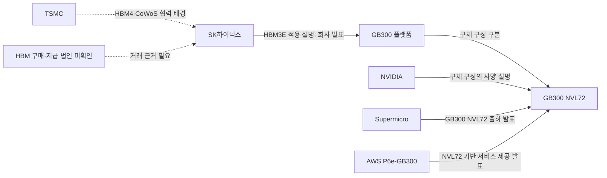

# HBM3E × NVIDIA GB300: 하이닉스 고객·상품 카드

조사 스냅샷: **2026-10-03**. 정리·통합일: **2026-10-04**. 상태: **`RESEARCH_CANDIDATE_NOT_GOVERNED_EVIDENCE`**.

목적은 하이닉스의 메모리 상품을 고객의 문제·요구 사양·채택 과정과 연결해 영업·마케팅·상품기획·신제품사업화 업무를 이해하는 것이다. [직무·상품 학습 기준](../sk_hynix_commercial_role_context.md)의 첫 사례이며, 확인된 관계와 앞으로 물어볼 질문을 구분한다.

[AI 기술·업무와 상품 요구의 연결표](../ai_technology_memory_links.md)는 이 사례를 서버 DRAM·SSD와 같은 조사 기준으로 읽되 플랫폼·계층·사건을 분리하는 공통틀이다. 아래 사양·사건의 기존 기준일과 미확인 값은 보존한다.

## 앞면: 누구의 어떤 문제를 이해할 것인가

### 1. 고객 문제와 상품 가치

**핵심 질문:** AI 추론 플랫폼은 왜 더 큰 메모리 용량과 대역폭을 요구하며, 그 요구가 어떤 검증·구매·공급 과정으로 하이닉스 상품과 연결되는가?

NVIDIA의 기술 설명은 LLM 추론의 GPU 메모리 요구에서 모델 가중치와 KV cache를 주요 요소로 다룬다. KV cache는 이미 계산한 정보를 보관해 이후 토큰 생성에 재사용하는 공간이다. 모델·문맥 길이·배치·정밀도·실행 방식이 달라지면 필요한 메모리와 성능 조건도 달라진다. 이는 개념 배경이며 특정 GB300 고객의 실제 병목을 측정한 결과가 아니다. **SRC-HBM-NV-INFERENCE**. [공식 기술 설명](https://developer.nvidia.com/blog/mastering-llm-techniques-inference-optimization/)

구체 구성의 참고 자료로, NVIDIA는 GB300 NVL72를 AI reasoning과 test-time scaling inference용 플랫폼으로 설명하고 큰 HBM3E 용량을 더 큰 배치와 긴 문맥 처리에 연결한다. **우리의 해석:** 하이닉스 상품의 가치는 메모리 숫자를 제시하는 데서 끝나지 않고 고객의 처리량·응답 시간·전력·출시 일정에 어떤 조건으로 기여하는지 설명하는 데 있다. 워크로드와 비교 조건을 확인하기 전에는 절감률이나 매출 효과를 계산하지 않는다. **SRC-HBM-NV-PRODUCT**. [공식 제품 설명](https://www.nvidia.com/en-us/data-center/gb300-nvl72/)

| 공개 자료가 확인하는 범위 | 아직 확인하지 못한 것 |
| --- | --- |
| 하이닉스는 2025 OCP에서 자사 36GB HBM3E가 적용된 GB300 모듈을 소개했다. **SRC-HBM-OCP25** | 모든 GB300 제품의 동일한 메모리 구성·공급사·공급 비중 |
| 2026 GTC 자료는 GB300 시스템에 사용되는 자사 HBM3E를 설명한다. **SRC-HBM-GTC** | 특정 고객의 주문·납품 물량, 인증 완료일, SKU와 가격 |
| NVIDIA의 공개 GB300 NVL72 사양은 72개 GPU·36개 CPU, GPU 메모리 20TB와 CPU 메모리 17TB LPDDR5X를 제시한다. **SRC-HBM-NV-PRODUCT** | 실제 고객 설치 구성·사용량, 하이닉스 메모리 배정 |

하이닉스의 적용 원문은 GB300 모듈/시스템까지 기명하며 NVL72를 특정하지 않는다. 그래서 GB300 상위 플랫폼 관계와 NVL72 구체 구성의 사양·출하·서비스 관계를 따로 연결한다. 자사 36GB HBM3E가 모든 NVL72에 적용됐다는 의미로 확대하지 않는다.

근거: [2025 OCP 전시](https://news.skhynix.com/en/sk-hynix-showcases-full-stack-ai-memory-portfolio-at-2025-ocp-global-summit/), [2026 GTC 설명](https://news.skhynix.com/en/gtc-2026-exhibition-booth/).

### 2. 고객은 한 회사 이름이 아니라 역할의 조합이다

| 역할 | 기명 주체·공개된 활동 | 지도에서 남길 공백 |
| --- | --- | --- |
| 칩·플랫폼 설계/사양 제시 | NVIDIA: GB300 플랫폼 사양과 사용 목적 설명 | HBM 구매·인증의 실제 담당 조직과 법인 |
| 메모리 개발·제조·판매 측 | SK하이닉스: 자사 HBM3E의 GB300 적용 설명 | 정확한 상품 코드·판매 계약·구매자·수량·단가 |
| 제조·패키징 협력 | 하이닉스–TSMC: HBM4 베이스 다이와 CoWoS 통합 개발 협력 발표 | 이 협력이 GB300의 실제 BOM·공장·납품 경로라는 연결 |
| 서버/랙 통합·판매 | Supermicro: GB300 NVL72 고객 출하 발표 | 그 출하분에 탑재된 HBM 공급사·하이닉스와의 구매 관계 |
| 클라우드 운영·서비스 제공 | AWS: P6e-GB300 UltraServers 일반 제공 발표 | HBM 직접 구매자, 실제 예약률·이용량·지역별 설치 수 |
| 최종 업무 사용자 | 해당 클라우드·시스템을 쓰는 AI 개발/서비스 조직 | 기명 고객의 워크로드·예산·사용량과 이번 상품의 연결 |
| HBM 주문·대금 지급 법인 | **`KNOWN_UNKNOWN`** | 주문서·계약·청구 경로가 없으면 위 브랜드로 대신 채우지 않음 |

각 화살표는 별도 공개 관계다. 이 그림은 하이닉스→Supermicro→AWS의 실제 거래 순서나 하나의 주문에 속한 공급망을 확인하지 않는다. TSMC 관계도 GB300 전용 생산 경로로 확정하지 않는다.

근거: **SRC-HBM-TSMC-MOU / SRC-HBM-SUPERMICRO / SRC-HBM-AWS**. [TSMC 협력 발표](https://news.skhynix.com/en/sk-hynix-partners-with-tsmc-to-strengthen-hbm-technological-leadership/), [Supermicro 공식 IR 출하 발표](https://ir.supermicro.com/news/news-details/2025/Supermicro-Begins-Volume-Shipments-of-NVIDIA-Blackwell-Ultra-Systems-and-Rack-Plug-and-Play-Data-Center-Scale-Solutions/default.aspx), [AWS 제공 발표](https://aws.amazon.com/about-aws/whats-new/2025/12/amazon-ec2-p6e-gb300-ultraservers-nvidia-gb300-nvl72-generally-available/).

### 3. 네 직무는 같은 관계를 서로 다른 질문으로 읽는다

아래는 **2026 하반기 JD 24페이지를 학습 질문으로 번역한 우리의 설계**다. 실제 하이닉스의 내부 업무 절차·고객 요청이나 수행 성과를 확인한 표가 아니다. JD 원문은 **SRC-HY26-JD**, [공식 채용공고 첨부](https://www.skcareers.com/Recruit/Detail/R261762)에 연결된다.

| 관점 | 가설 → 필요한 정보 | 질문 → 연습할 산출물 |
| --- | --- | --- |
| 영업 | 플랫폼 전환·구매 단계가 계정별 확인 순서에 영향을 준다 → 사양 결정자·구매 법인·인증·납기 조건 | 누가 어떤 상품을 언제 구매하며 요구가 언제 고정되는가? → 계정 역할·구매 단계·확인 과제 카드 |
| 마케팅 | 큰 용량·대역폭의 가치는 업무별로 다르다 → 워크로드·문맥·배치·지연 목표·비교 시스템·전력 조건 | 고객의 현재 제약과 개선을 판단할 기준은 무엇인가? → 고객 문제–기술 특성–검증 조건 표 |
| 상품기획 | 다음 플랫폼의 요구 변화가 제품 구성에 영향을 준다 → 용량·대역폭·패키지·전력·열·로드맵 개정 | 필수 요구와 선택 요구는 무엇이며 어떤 변경에 대응해야 하는가? → 요구 사양–상품–플랫폼 연결표 |
| 신제품사업화 | 적용 설명 이후에도 인증·구매·출하 확인이 필요하다 → 단계별 완료 조건·기술 지원·책임 주체·목표일 | 남은 검증 항목과 완료 근거는 무엇인가? → 플랫폼별 단계·공백·후속 확인 표 |

**타겟을 정하기 전에 확인할 것:** NVIDIA의 플랫폼 요구, OEM의 시스템 통합 조건, 클라우드 운영자의 업무·배치 조건을 각각 조사한다. 이 조사 대상 선정은 실제 판매 권고가 아니다. 구매 법인·요구·지원 범위·납기가 확인돼야 구체적인 계정 제안을 검토할 수 있다.

## 뒷면: 무엇을 무료로 관측할 것인가

### 4. 공개 관측 후보 8개

아래는 직무 질문을 좁히기 위한 수집 설계다. 선행성 검증·지표 순위·KPI 목표가 아니다. 점검 주기는 **운영 제안**이며 자동 수집·모니터링은 아직 실행하지 않았다. 실제 주문량·ASP·고객 매출·인증 완료일 등 내부 지표가 공개되지 않으면 아래 프록시로 대체하지 않는다.

#### O1. 플랫폼 요구 개정

- 정의·단위: 메모리 세대·용량·대역폭·전력/냉각 사양과 개정. `플랫폼×구성×문서 버전`.
- 공식 수집원·접근: NVIDIA 제품 페이지·데이터시트·reference architecture의 무료 웹/PDF.
- 연결키: 플랫폼명, 구성/SKU, 문서 버전, 확인일.
- 점검 제안: 월 1회와 신규 문서 발표 때.
- 직무 질문: 상품기획의 Target Spec/Product Mix. 어떤 요구 변화에 대응해야 하는가?
- 한계: 발표 사양은 주문량·특정 공급사 배정이 아니다. 구성·버전이 다른 값을 합치지 않는다.

#### O2. 기명 메모리 적용·채택 사건

- 정의·단위: 샘플·인증·design-in·양산·출하의 원문 단계. `공급사×상품×플랫폼×사건`.
- 공식 수집원·접근: 하이닉스·고객 공식 뉴스룸/IR의 무료 웹 원문.
- 연결키: 법인/브랜드, 상품 세대/코드, 플랫폼, 사건일.
- 점검 제안: 주 1회와 공식 행사·실적 발표 때.
- 직무 질문: 사업화의 Qualification/TTM. 어떤 검증·채택 근거가 있고 무엇이 남았는가?
- 한계: 전시·양산 준비·인증·출하는 다른 사건이다. 사전 단계에서 완료일을 만들어내지 않는다.

#### O3. OEM 시스템 제공·출하

- 정의·단위: 특정 시스템 SKU의 발표·판매·출하 상태. `OEM×SKU×플랫폼×시점`.
- 공식 수집원·접근: OEM 공식 제품·매뉴얼·IR 발표의 무료 웹/PDF.
- 연결키: OEM, 시스템 SKU, 플랫폼 구성, 사건일/공개일.
- 점검 제안: 월 1회와 제품 발표 때.
- 직무 질문: 영업의 계정 단계·납기. 고객 시스템이 실제 제공·출하되는 단계인가?
- 한계: 시스템 출하에서 하이닉스 HBM 공급량·공급 비중을 계산할 수 없다.

#### O4. 클라우드 도입 범위

- 정의·단위: preview/GA·인스턴스·지역·공개 제공 조건. `CSP×인스턴스×지역×상태`.
- 공식 수집원·접근: AWS 등 CSP의 공식 발표·인스턴스 문서, 무료 웹.
- 연결키: CSP, 인스턴스 SKU, 지역, 상태, 해당 일자.
- 점검 제안: 월 1회와 서비스 출시·지역 변경 때.
- 직무 질문: 고객 우선순위·수요 배경. 어느 사용 환경에서 플랫폼 접근이 가능해졌는가?
- 한계: GA는 예약률·사용률·설치 수·HBM 직접 구매를 확인하지 않는다.

#### O5. 워크로드 비교 조건

- 정의·단위: 모델·정밀도·시나리오·시스템·성능/전력 공개 항목. `제출×시험 버전×워크로드`.
- 공식 수집원·접근: MLCommons 공식 결과·공개 제출 파일, 무료 웹/파일.
- 연결키: 제출 ID, 버전, 모델/시나리오, 시스템 구성.
- 점검 제안: 새 결과가 공개될 때.
- 직무 질문: 마케팅 가치·상품 사양. 같은 조건에서 고객 문제를 설명할 수 있는 비교인가?
- 한계: 이번에는 발표만 확인했고 결과 추출·비교는 하지 않았다. 시스템 개선을 HBM 단독 효과로 해석하지 않는다.

#### O6. 배치 시설 조건

- 정의·단위: 랙 전력·냉각 요구와 기명 부지의 승인·설치·가동 사건. `구성×시설×사건`.
- 공식 수집원·접근: NVIDIA/OEM 기술 문서, 해당 고객·규제기관 원문, 무료 웹/PDF.
- 연결키: 플랫폼 구성, 실제 부지 ID, 사건일.
- 점검 제안: 기술 문서 개정·기명 시설 사건 때.
- 직무 질문: 납기·공급 위험. 고객이 그 시스템을 배치하기 위해 남은 조건은 무엇인가?
- 한계: 이번 카드에는 기명 시설 연결이 없다. 설계 kW는 실제 운영 전력·에너지 MWh와 다르다.
- 현재 수집 범위: 공개 설계 요구만 확인했다. 시설 준비·승인·가동 관측은 수집 설계 단계다.

#### O7. 투자·구매 약정 범위

- 정의·단위: CAPEX·계약·현금 항목의 대상·기간·조건. `법인×기간×계약/항목`.
- 공식 수집원·접근: 고객 IR·SEC/DART 원문, 무료 공개 문서.
- 연결키: CIK/corp_code, 측정 기간, 계약 ID/공시 문서·항목.
- 점검 제안: 분기 공시와 중요 계약 공시 때.
- 직무 질문: 고객 투자 여력·구매 지속성. 금액이 어떤 대상·기간·조건에 적용되는가?
- 한계: 회사 전체 금액을 GB300/HBM 구매로 배분하지 않는다. 약정과 실제 현금 집행을 분리한다.
- 현재 수집 범위: 이번 카드에서는 재무 값·계약금액·현금 집행을 수집하지 않았다.

#### O8. 상품 공급 준비·변경

- 정의·단위: 제품 세대·기명 공정/부지의 계획·가동·공급 준비·일정 변경. `상품×부지×사건`.
- 공식 수집원·접근: 하이닉스·확인된 파트너의 공식 발표/공시, 무료 웹.
- 연결키: 상품, 공정/부지, 사건, 목표일/실제일.
- 점검 제안: 분기 발표와 개별 변경 공시 때.
- 직무 질문: 사업화 TTM·Supply Risk. 고객 일정에 연결하려면 무엇을 더 확인해야 하는가?
- 한계: 수율·유효 CAPA·고객별 배정은 공개되지 않으면 미확인이다. 계획과 가동을 구분한다.
- 현재 수집 범위: 상품 세대의 공급 배경 설명만 확인했다. GB300 고객별 공급 준비·배정은 미수집이다.

O1~O4는 앞면의 공식 자료로 출발할 수 있다. O5는 **SRC-HBM-MLPERF**가 안내하는 [MLPerf Inference v6.1 공개 결과](https://mlcommons.org/2026/09/mlperf-inference-v6-1-results/)를 후속 검토한다. O6~O8의 특정 고객·시설·기간 연결은 아직 수집 과제이며 관측 완료로 표시하지 않는다.

첫 카드에 새 API 발급은 필수가 아니다. 공식 웹/PDF·공개 파일을 먼저 기록한다. O7의 공시 검색을 반복할 때 보유 DART를 활용할 수 있고 SEC 공개 데이터는 키 발급보다 식별 User-Agent·접근 결과 관리가 필요하다. 특정 API를 이번에 호출·검증·활성화했다는 뜻은 아니다.

## 추적 부록: 같은 이름과 숫자를 섞지 않는 법

### 5. 상품 단위와 사양 충돌

HBM 스택은 여러 DRAM 다이를 적층한 메모리 상품 단위이고 GPU·Superchip·트레이·랙은 다른 구성 단위다. GB300 플랫폼과 HGX B300도 구별한다. 공개된 사양을 곱해 하이닉스 고객 물량·매출·점유율·CAPA를 만들지 않는다.

| 자료·위치 | 원문이 제시한 단위·값 | 보존할 구분·공백 |
| --- | --- | --- |
| **SRC-HBM-OCP25**, HBM 전시 문단 | 하이닉스 HBM3E 36GB 적용 설명 | HBM 상품의 용량. 전체 GPU/랙 용량과 별도 |
| **SRC-HBM-NV-PRODUCT**, 사양 표 | GPU 72개·CPU 36개, GPU 메모리 20TB·CPU 메모리 17TB LPDDR5X, 전체 fast memory 37TB | 37TB 전체를 HBM이라고 부르지 않음. 합계는 공개 표의 표현이며 공급사별 배분 아님 |
| **SRC-HBM-NV-DATASHEET**, PDF 5페이지 | 개별 GPU 표: GB300 구성 279GB HBM3E·8TB/s, HGX B300 구성 270GB HBM3E·7.7TB/s | 서로 다른 구성의 값을 보존. 문서 식별자 `4169750. Oct25`는 버전 단서이며 정확한 게시일은 미확인 |
| **SRC-HBM-NV-RA**, compute tray 서술·표 | 트레이당 GPU 4개·Grace CPU 2개, GPU 4개 합산 메모리 1,152GB HBM3로 표기 | 데이터시트의 개별 GPU 279GB와 트레이 합산 1,152GB는 자료별 단위와 값을 보존한다. 값의 차이와 HBM3/HBM3E 표기 차이의 원인은 미확인 |
| **SRC-HBM-NV-RA**, 랙 요구 bullet | 전체 랙 최대 142kW 요구 설명 | 설계 요구값. 실제 운영 전력·시설 전력 계약·에너지 사용량과 별도 |

데이터시트 5페이지는 텍스트 추출과 렌더 화면을 검토했고, reference architecture의 원본 HTML에서 GPU 행 수량 4를 확인했다. 개별 GPU 279GB와 GPU 4개 트레이 합산 1,152GB, HBM3E와 HBM3라는 자료별 값·표기 차이는 그대로 보존한다. dual-die·ECC·사용 가능 용량·예약 용량 등으로 차이를 설명할 근거는 확인하지 않았다. 자료별 단위·버전·구성을 유지하고 실제 고객 사양을 후속 확인한다. [공식 데이터시트](https://dam-cdn.nvd.orangelogic.com/AssetLink/1k0p832eq8r5ca0u5383ie5o4tp3bst1.pdf), [공식 구성 문서](https://docs.nvidia.com/enterprise-reference-architectures/nvl72-ai-factory/latest/components.html)

### 6. 관계와 단계는 날짜별로 독립 기록한다

| 공개 자료·날짜 | 기록할 관계·단계 | 이 사건으로 확인하지 않는 것 |
| --- | --- | --- |
| **SRC-HBM-OCP25**, 공개 2025-10-31 | 자사 36GB HBM3E가 적용된 GB300 모듈 전시 설명 | 전체 고객 인증·모든 출하 구성·실제 발주 |
| **SRC-HBM-GTC**, 공개 2026-03-16 | GB300에 사용되는 HBM3E 설명. 같은 자료의 Rubin 관련 함께 전시는 별도 문장으로 기록 | 나란히 전시한 모든 제품의 동일한 탑재·출하 상태 |
| **SRC-HBM-SUPERMICRO**, 공개 2025-09-11 | OEM의 GB300 NVL72 고객 출하 발표 | 하이닉스의 해당 OEM 대상 출하·고객별 물량 |
| **SRC-HBM-AWS**, 공개 2025-12-02 | P6e-GB300 서비스 일반 제공 발표 | 고객의 실제 이용·가동률·HBM 직접 구매 |
| **SRC-HY26-NVIDIA**, 페이지 2026-06-07 / 본문 2026-06-08 | 다년 기술 협력·공급 지원 발표 | 개별 상품의 주문서·수량·가격. 날짜 차이는 보존 |
| **SRC-HY26-Q2**, 공개 2026-07-29 | 회사 전체의 2분기 HBM4 대량 출하 설명 | GB300 HBM3E 고객의 10월 납품 상태·Rubin 고객별 출하 |
| **SRC-HBM-OIP**, 행사 2026-09-23 / 공개 2026-09-28 | Rubin 전시품에 자사 12단 36GB HBM4가 장착됐다는 회사 설명 | 전체 Rubin 시스템의 구성·고객 주문·양산 공급량 |

HBM4–Rubin을 미래 계획만으로 고정하지 않는다. 9월 OIP 자료의 전시품 장착 설명은 3월 자료의 함께 전시 설명과 별도 사건으로 보존한다. 회사 전체 출하 단계와 특정 플랫폼·고객의 단계도 서로 대체하지 않는다. 이 카드의 중심 사례는 GB300–HBM3E로 유지한다. **SRC-HBM-OIP**. [9월 OIP 공식 자료](https://news.skhynix.com/en/tsmc-oip-conference-2026/)

공개일, 사건일, 문서 업데이트일, 조사일, 측정 기간, 미래 목표일을 별도 저장한다. NVIDIA 제품 페이지의 별도 공개일은 확인되지 않았고, reference architecture는 2026-09-15 업데이트 표기를 확인했다. 조사일을 공개일로 쓰지 않는다. 기술 글의 원게시일 2023-11-17도 이번 조사일과 구분한다.

### 7. 미공개 지표와 반론

| 실제 판단에 필요할 수 있는 정보 | 이번 카드의 상태·대체하면 안 되는 자료 |
| --- | --- |
| HBM 주문·지급 법인, 계약·물량·단가·ASP | **`KNOWN_UNKNOWN`**. 브랜드 협업·OEM 출하·클라우드 GA로 대체하지 않음 |
| 고객 인증 완료일·승인 항목·design-in 확정 | **`KNOWN_UNKNOWN`**. 제품 적용 설명·전시로 완료일을 만들지 않음 |
| 고객별 출하·매출·메모리 공급 비중 | **`KNOWN_UNKNOWN`**. 랙 사양·전체 시장 점유율·회사 실적을 배분하지 않음 |
| 수율·원가·유효 CAPA·고객별 배정·납기 약속 | **`KNOWN_UNKNOWN`**. 증설 계획·양산 준비·파트너 협력으로 계산하지 않음 |
| 고객 실제 워크로드·활용률·전력·TCO | **`KNOWN_UNKNOWN`**. 예상 성능·설계 전력·벤치마크로 대체하지 않음 |

반론도 다음 질문에 포함한다. 메모리 관리·정밀도·모델 구조가 바뀌면 같은 업무의 용량 요구가 달라질 수 있다. 시스템 개선이 연산·네트워크·소프트웨어에서 왔을 수 있고, 플랫폼 제공 발표 이후에도 고객의 시설·예산·구매 승인이 남아 있을 수 있다. 이런 공백은 추가 조사 이유이며 하이닉스 수요 증감의 결론이 아니다.

### 8. 출처 영수증과 작업 경계

- [카드 데이터](../../../../data/research/customer_product_cards/hbm_nvidia_gb300/2026-10-03/card.json): 관계·상품·직무 질문·관측 후보와 미확인 항목.
- [출처 영수증](../../../../data/research/customer_product_cards/hbm_nvidia_gb300/2026-10-03/sources.json): Source ID, 실제 접근 URL, 공개일·조사일, locator, 제한된 원문 발췌, 원문 해시·크기와 접근 결과.
- [패키지 목록·해시](../../../../data/research/customer_product_cards/hbm_nvidia_gb300/2026-10-03/manifest.json): 공개 산출물의 목록과 무결성 확인 정보.

이번에 새로 확인한 공식 자료 11건과 기존 직무·협력·실적 자료 3건을 연결한다. Supermicro 자료는 본 사이트 접근 실패 후 공식 IR 경로에서 수집했고, 실제 성공 URL을 기록했다. 원문 HTML/PDF 전체는 공개 저장소에 재배포하지 않으며 공개 패키지만으로 원문 전체 바이트 재생을 보장하지 않는다.

공식 출처는 발표 주체의 설명을 확인하는 근거다. 독립 검증된 사업 성과·실제 판매 권고·지원서 성과로 승격하지 않는다. 기존 69개 주체·58개 관계의 지도는 변경하지 않았고 이 카드는 별도 학습 단위다. H1 편입·Gate 6 승인·정식 Evidence·Strong Inference·선행성 검증 상태는 바뀌지 않는다.

**후속 상품 카드 후보:** 서버 DDR5–Intel Xeon 6에서 플랫폼 인증, OEM 통합과 실제 모듈 구매자를 구분한다. 2026-10-04 현재 다음 작업은 [거시 기준판](../semiconductor_macro_structure.md)의 첫 DRAM·NAND 관측표로 옮겼다.
