# 지표를 왜 모으고 무엇을 체크하는가

기준일 **2026-10-05**. 상태 **연구 후보의 목적·측정 설계**. 이번 사용자 지시는 수집 목적을 명확히 한 뒤 기존 후보를 검토하는 것이다. API 호출 파일럿과 DDR5 고객 카드는 보류한다. 접근 가능성은 [기존 API 점검](api_signal_feasibility.md)에, 이번 적합성 검토는 이 문서와 [목적 등록표](../../../data/research/indicator_purpose_review/2026-10-05/purpose_registry.json)에 둔다.

**오프라인 재현(2026-10-06 보완):** repository root에서 `python scripts/validate_current_research.py`를 실행하면 기존 API 자료와 이 목적 등록표의 바이트·원 참조·40개 검토 객체·문서 분류·후보 상태를 함께 확인한다. 경제적 타당성·선행성·사람 승인은 이 검사로 확정하지 않는다.

우리가 확인하려는 것은 **AI와 산업 변화가 누구의 어떤 반도체 요구로 이어지고, 구매·공급·설치·자금의 어느 단계까지 실제로 진행됐는가**다. 하이닉스 관점에서는 고객의 문제·상품 요구·도입 일정·공급 조건을 설명하는 배경지식을 만드는 데 쓴다. 지표의 변화는 조사할 관계와 가정을 갱신하는 근거이며, 현재 주문량·세계 수요·투자수익률의 결론은 아니다.

## 먼저 고정할 질문

| 질문 | 어느 주체 사이의 관계인가 | 왜 수집하고 무엇을 체크하는가 | 확인 후 갱신할 내용 |
| --- | --- | --- | --- |
| Q1 상품 요구 | AI 개발사·사용자 → 클라우드/플랫폼 설계자 → GPU/ASIC/OEM → 메모리 공급사 | 업무·모델·backend·정밀도·context·batch 변화가 용량·대역폭·지연·전력·내구 요구를 어떻게 바꾸는가 | 상품 요구를 설명하는 조건과 기술 자료. 실제 채택·주문은 별도 확인 |
| Q2 구매 실행 | 클라우드·OEM·칩 설계사 ↔ 장비·메모리 공급자 | 누가 사양 결정자·검증자·구매자·사용자인가. 계획이 계약 발효·인증·주문·납품으로 진행됐는가 | 대상 법인·제품·구매 단계·목표일과 남은 조건 |
| Q3 공급 실현 | 메모리·파운드리·후공정 ↔ 장비·소재 공급사 ↔ 고객 | 생산·출하·재고·후공정 준비가 어떤 방향인가. 물량·가격·믹스·능력 변화 중 무엇인가 | 공급 준비 단계와 제약 후보. 회사/제품 자료가 없으면 국가·산업 배경으로 유지 |
| Q4 설치·가동 | DC 운영사 ↔ 전력 판매자·계통 운영자·설비 공급자 ↔ 승인기관 | 같은 사업의 전력 계약·승인·착공·수전·가동·실측이 어디까지 확인됐는가 | 고객 일정의 근거와 미충족 조건. 지역 이동·일정 지연·규모 수정도 검토 |
| Q5 경로 위험 | 소재/장비 수출자 ↔ 수입자·제조사, 정부·규제기관·협정 당사자 | 품목·순도·공정·국가·관할·효력·대체 가능성이 어느 상품 경로의 조건을 바꾸는가 | 영향을 조사할 구체 품목·법인·시설·규칙. 검색 결과는 적용 판단의 출발점 |
| Q6 사업 자금 | 정부·대주·투자자 → 차입/수령 법인 → 장비·건설·기타 공급자 | 누가 예산·약정·의무액을 만들고 누가 수령·인출·설비 지급했는가 | 자금 단계·상대방·기간. 약정과 집행의 차이를 확인 |
| Q7 증권 배분 | ETF 투자자 ↔ 운용사 ↔ 증권시장 | 테마 비중 변화가 가격·보유 수량·펀드 규모·리밸런싱 중 무엇으로 발생했는가 | 투자자 배분의 설명. 고객의 반도체 구매·기업 현금 수취와 분리 |

Q1~Q3이 상품·고객·공급 질문의 중심이다. Q4~Q6은 그 경로에 실제 연결될 때 확장하며, Q7은 별도 금융 관측이다. 모든 주체의 모든 값을 모으는 것이 완료 조건이 아니다. 사양 결정·인증·구매·사용 역할은 같은 회사에서도 달라질 수 있으므로 거래마다 확인한다.

## 지도에서 관측할 것은 노드보다 관계의 상태다

한 회사의 매출을 기록하는 것과 그 회사가 어느 제품을 누구에게 공급했는지 확인하는 것은 다른 작업이다. 관계는 `당사자 A / 역할 → 관계 종류 → 당사자 B / 역할`에 제품·플랫폼 세대, 계약/프로젝트, 시설, 사건일·공개일, 원 단계와 조건을 붙여 기록한다. 금액이나 물량이 공개되지 않으면 비워 둔다.

```mermaid
flowchart LR
    W[업무·기술 조건] -->|요구를 검토| M[상품·플랫폼 사양]
    M -->|채택 사실 별도 확인| C[고객 인증·계약·구매]
    S[팹·소재·패키징·검사] -->|공급 준비·납품 확인| C
    P[전력·부지·허가·설치] -->|같은 시설 연결 확인| O[가동·사용]
    C -->|설치·이행 별도 확인| O
    F[정부·금융·기업 지출] -->|동일 사업·상대방 확인| S
    F -->|동일 사업·상대방 확인| P
    E[ETF 증권 배분: 별도 금융 관측]
```

화살표는 확인할 질문의 경로이며 인과·시간 순서를 증명하지 않는다. ETF에서 기업으로 돈이 직접 지급됐다는 관계도 아니다. 자금, 물리적 준비, 구매 수용, 운영은 병렬로 기록한다. 메모리 발주는 통전보다 앞설 수 있고 정부 지급은 진행된 지출 뒤에 나타날 수도 있다.

| 제품·기능 축 | 먼저 체크할 상품/공급 질문 | 확장할 연결과 멈추는 지점 |
| --- | --- | --- |
| HBM × GPU/ASIC, PROD-01/05 | 실제 플랫폼의 메모리 요구, 인증·상업 출하, good stack·패키징·검사 준비 | 고객 CAPEX·DC 전력은 같은 플랫폼·고객·시설 관계가 있어야 연결. AI 성장률을 HBM 물량으로 환산하지 않음 |
| 서버 DDR·LPDDR, PROD-02/03 | 플랫폼별 용량·채널·전력 조건, 실제 구성·도입 단계 | HBM과 동일 수요로 합치지 않음. DDR5 고객 카드 작업은 보류 |
| NAND·eSSD, PROD-04 | 저장 용량·성능·내구·운영 조건과 인증·출하·재고 | 파일 다운로드나 데이터 생성량만으로 SSD 구매량을 계산하지 않음 |
| 파운드리·EDA/IP·패키징/검사, PROD-06/07 | 설계/제조 기능, 공정 세대·공급 준비·고객 수용 | 국가 C261 생산·회사 월매출만으로 특정 wafer·package 능력·배정을 추정하지 않음 |
| 장비·소재, PROD-08 | 설치·조달·순도·공정 적용·대체·검증 조건 | 무역·USGS는 국가/품목 배경. 직접 공급사·fab 연결은 원문 필요 |
| 전력소자·광연결, PROD-09/10 | 전력 변환·통신 기능, 부품 채택·공급·설치 단계 | GaN/SiC·InP의 기능과 메모리 수요를 구분. 지역 전력은 부품 구매량이 아님 |
| RF·항공우주 전원, PROD-11/12 | 주파수/임무·환경·신뢰성 조건, 기명 인증·임무 채택 | 데이터센터와 다른 고객·조달 주기. 같은 반도체라는 이유로 AI 수요를 전파하지 않음 |

제품 ID와 실제 기업 사례의 상세 근거는 [산업 전파 경로](semiconductor_industry_transmission_routes.md), [AI 기술과 상품 요구](ai_technology_memory_links.md), [첫 메모리 분기 관측](memory_observation_panel_2026q2.md)을 참조한다. 위 표는 기존 구조의 질문 배치이며 새 고객 거래를 확인한 표가 아니다.

## 변화가 생기면 무엇을 검토할 것인가

아래는 **조건부 조사 규칙의 예시**다. 이번 작업에서 해당 변화가 발생했다고 관측한 결과가 아니다. 임의의 증가율·점수·임계값을 만들지 않았다. 먼저 같은 정의와 공개 이력으로 비교 가능한지 확인하고, 변화와 대체 설명을 함께 저장한다.

| 조합 또는 사건 후보 | 체크할 내용 | 필요한 다음 근거 / 판단을 멈출 조건 |
| --- | --- | --- |
| AI 관심↑ 또는 software release | 고정 모델·기능·backend·workload의 요구가 달라졌는가 | 공식 실행 조건·비교 자료·기명 채택이 없으면 관심/기술 사건으로 유지. HF 다운로드는 GET/HEAD 기반 파일 요청 통계이며 추론량 아님 |
| CAPEX 계획↑, 실제 현금 지출은 다름 | 같은 법인·회계기간·현금/리스·대상 사업인가 | 가이던스 원문·수정·선급·리스·사업 배분 확인. 현금 PP&E 태그 하나로 계획 대비 실행을 판단하지 않음 |
| 생산↑, 출하↓, 재고↑ | 같은 분류·단위·조정인가. 누적·가격·믹스·평가 변화인가 | 회사 bit 출하·ASP·믹스 설명을 대조. 산업지수 간 차이를 물량 항등식이나 공급 과잉 판정으로 계산하지 않음 |
| 월매출↑, 수출액↑ | 가격·환율·믹스·재수출·관측월이 달라졌는가 | 물량/단가 자료와 회사 설명 필요. 회사/국가 두 총액의 일치를 같은 고객 수요로 연결하지 않음 |
| 접속·허가·설치 목표일 지연 | 같은 프로젝트의 원 조건·수정일·공급 경로인가 | 주문 일정·재고 확보·다른 지역 배치·명시 취소를 따로 확인. 수전 지연이 메모리 주문 취소를 자동 뜻하지 않음 |
| 발전·권역 부하↑ | 발전/소비·MW/MWh·실측/예측·날씨·다른 산업을 구분했는가 | 동일 DC 미터/공급·전달 관계 없으면 지역 배경으로 유지 |
| 소재 공급 집중 또는 정책 공표 | 순도·공정·품목·관할·효력·예외·대체가 관련되는가 | 실제 공급자·상품 규격·현행 원문 확인. 연간 구조·proposed rule·MOU는 현재 납품 제약 확정 아님 |
| 정부 award/obligation/outlay | 누적 약정, 기간 의무액, 보고기간 지급 중 무엇인가 | 같은 award·법인·사업·정정·reporting period 확인. 기업 CAPEX와 이중 합산 금지 |
| ETF 비중↑ | 가격 효과, 수량 변화, 발행좌수, rebalancing 중 무엇인가 | 같은 시점 NAV·과거 snapshot·corporate action 없으면 flow 계산 보류. 단일 ETF를 기관 전체로 확대하지 않음 |

[HF의 다운로드 정의](https://huggingface.co/docs/hub/models-download-stats), [Comtrade preview의 부분 결과](https://uncomtrade.org/docs/what-is-data-preview/), [USAspending endpoint 구분](https://api.usaspending.gov/docs/endpoints), [Eurostat API 설명](https://ec.europa.eu/eurostat/web/user-guides/data-browser/api-data-access/api-introduction)을 이번에 다시 읽었다. 데이터 API를 새로 호출하거나 이전 접근 기록을 갱신하지 않았다. 각 값의 단위·필드·측정 기간은 기존 packet의 계약이 기준이다.

‘선행’은 **무엇보다 앞서는가**를 먼저 정해야 한다. 제품 인증, 주문, 출하, 시설 가동, 매출·현금은 서로 다른 대상 사건이다. 사건일이 아니라 실제 `known_at` 공개 이력과 개정을 복원하고 비교 기준·역사 관측으로 검증하기 전에는 선행 기간·예측력·지표 순위를 산출하지 않는다. 주간 관측이나 앞 단계 발표라는 이유만으로 선행지표가 되지 않는다.

## 기존 후보의 수집 적합성 검토

기존 34개 번호 지표와 6개 가족 측정 계약을 모두 ID별로 검토했다. **40개 검토 객체이며 고유 경제 지표 40개라는 뜻은 아니다.** TWSE 월매출과 비교율, 정부 자금의 각 단계, 두 무역 출처 등은 겹친다. 중요도는 이번 목적 설계의 판단이고 API 준비 상태·예측력의 점수는 아니다.

| 분류 | 채택 기준 | 현재 판단 |
| --- | --- | --- |
| 핵심 질문 | 상품 요구·기명 고객 실행·공급 실현을 설명하는 기본 관측 | 7개 검토 객체. 접근 실패/미정의 상태도 그대로 표시 |
| 관계 확인 후 | 같은 법인·제품·프로젝트·시설·관할을 확인한 사례에서 수집 | 10개. 국가·범용 검색을 기명 경로로 좁혀야 함 |
| 보조 | 산업·국가·플랫폼·증권 배경, 대체 설명·교차 질문 | 17개. 핵심 관측을 대신하지 않음 |
| 분석 보류 | 추가 정보 가치·정의·역사가 부족한 신규 시계열/파생 계산 | 3개: 모델 likes, 개발자 관심의 별도 시계열, ETF 순설정 계산 |
| 필수 검증 | 버전·기간/coverage·금액 비교 규칙을 관리하는 전용 항목 | 3개. 경제 신호로 점수화하지 않음 |

**필수 검증은 모든 분류에 공통으로 적용한다.** 별도 전용 항목 3개만 검사한다는 뜻이 아니다. 모든 관측에 출처·분류판·단위·기간·잠정/개정·coverage·날짜·권리를 확인한다. 보조라는 이유로 값이 불명확한 자료를 사용하지 않는다.

| 기존 ID | 질문 / 역할 | 왜 수집하고 무엇을 체크하는가 | 수집 판단 |
| --- | --- | --- | --- |
| `AIAPI01-PLATFORM-TOKENS` | Q1 | 고정 모델군 토큰의 포함 범위·window·tokenizer를 구분 | 관계 확인 후 |
| `AIAPI02-MODEL-DOWNLOADS30` | Q1 | 고정 cohort의 rolling 요청 관심과 버전 | 보조 |
| `AIAPI03-MODEL-LIKES` | Q1 | 실제 채택 조사에 추가 정보가 있는지 평가 | 분석 보류 |
| `AIAPI04-MODEL-VERSION-TASK` | Q1 | 모델 ID·sha·task와 실행 조건의 기준점 | 핵심 질문 |
| `AIAPI05-SOFTWARE-RELEASE` | Q1 | release/tag/commit의 기능·backend 적용 조건 | 핵심 질문 |
| `AIAPI06-DEVELOPER-INTEREST` | Q1 | 기술 사건 이상의 관심 시계열 가치 | 분석 보류 |
| `AIAPI07-REPO-FRESHNESS` | 자료 통제 | 참고 repo 상태와 인용 commit | 필수 검증 |
| `ROOTAPI01-CUSTOMER-CASH` | Q2/Q6 | 현금 PP&E와 별도 가이던스의 기간·정의 | 핵심 질문 |
| `ROOTAPI02-CONTRACT-FILING-EVENT` | Q2/Q6 | exhibit의 당사자·상품·조건·수정·납기 | 핵심 질문 |
| `ROOTAPI03-KR-CASH-INVENTORY` | Q3/Q6 | 재고 잔액과 CAPEX 기간 흐름을 분리 | 핵심 질문 |
| `ROOTAPI04-KR-FILING-SEARCH` | Q2/Q3 | 접수번호·정정·원문과 실제 사건 | 핵심 질문 |
| `ROOTAPI05-US-PRODUCTION` | Q3 | 같은 IPG3344S 분류·기준·월별 활동 | 보조 |
| `ROOTAPI06-US-UTILIZATION` | Q3 | CAPUTLG3344S의 능력/가동 정의 | 보조 |
| `ROOTAPI07-ELECTRICAL-BACKLOG` | Q4/Q3 | broad 업종 기말 주문잔고와 수요·생산·취소 | 보조 |
| `ROOTAPI08-FX-CONTROL` | 자료 통제 | 통화·기간·환산 종류와 명목 효과 | 필수 검증 |
| `ROOTAPI09-ETF-POSITION` | Q7 | 같은 펀드·증권·날짜의 수량·비중·가격 | 보조 |
| `ROOTAPI10-ETF-NETCREATION` | Q7 | 과거 발행좌수·같은 시점 NAV·기업행동 | 분석 보류 |
| `API-PP-01` | Q4 | 같은 발전기 상태·명판 MW·기명 공급 관계 | 관계 확인 후 |
| `API-PP-02` | Q4 | 같은 시설·연료·월의 실제 순발전 | 관계 확인 후 |
| `API-PP-03` | Q4 | 미국 권역 actual/forecast·날씨·개정 | 보조 |
| `API-PP-04` | Q4 | 유럽 EIC area·시간대·실측 유형 | 보조 |
| `API-PP-05` | Q5/Q4 | 규칙의 관할·품목·종류·시행·정정·정지 | 관계 확인 후 |
| `API-PP-06` | Q5/Q4 | 같은 docket의 절차·지원 문서·철회·기한 | 관계 확인 후 |
| `API-PP-07` | Q6 | award 수령자·프로젝트 적합성·누적 범위 | 관계 확인 후 |
| `API-PP-08` | Q6 | action_date의 기간별 의무액·감액·정정 | 관계 확인 후 |
| `API-PP-09` | Q6 | File C/TAS·보고기간·누적/증분·지급 범위 | 관계 확인 후 |
| `API-PP-10` | Q4 | 발전/전달 queue의 종류·취소·시공·가동 | 관계 확인 후 |
| `API-PP-11` | Q4 | PJM 계측/추정/잠정 feed의 같은 시점 부하 | 보조 |
| `API-PP-12` | Q4 | 예측 vintage·목표연도와 동일 peak 정의 | 보조 |
| `API-PP-13` | Q4 | 싱가포르 국가 월 발전량 GWh·관측 종료월 | 보조 |
| `API-PP-14` | Q5/Q4 | 협정·조건부 승인·PPA·금융종결·운전 | 관계 확인 후 |
| `TWAPI01-MONTHLY-REVENUE` | Q3 | 회사별 월매출·원단위·보고범위 | 보조 |
| `TWAPI02-PROVIDER-COMPARATIVES` | Q3 | 원금액·기간·반올림에 맞는 제공자 비교 | 보조 |
| `TWAPI03-PERIOD-COVERAGE-FRESHNESS` | 자료 통제 | 회사별 관측월·출표일·빈값·정정·coverage | 필수 검증 |
| `TM-01-UN-COMTRADE` | Q3/Q5 | 같은 HS 판·월·상대국·flow·가치/중량/수량 | 보조 |
| `TM-02-EUROSTAT` | Q3 | PRD/C261/I21/SCA/DE의 산업 활동 | 보조 |
| `TM-03-OECD-TIVA` | Q5 | 같은 판·연도·C26·분모의 해외 부가가치 구조 | 보조 |
| `TM-04-KOSIS` | Q3 | exact 반도체 표의 생산/출하/재고 세 항목 | 핵심 질문 |
| `TM-05-KOREA-CUSTOMS` | Q3/Q5 | HS 상세 품목·국가·FOB/CIF·월·정정 | 보조 |
| `TM-06-USGS-MATERIAL-FILES` | Q5 | 소재 형태/순도·측정연도·생산/능력/매장량 | 보조 |

각 행의 당사자 관계, 후속 행동, 금지 해석, 실제 수집 전제와 원 packet의 JSON pointer는 [목적 등록표](../../../data/research/indicator_purpose_review/2026-10-05/purpose_registry.json)에 있다. 단위·endpoint·field·권리·접근 성공/실패는 [API 통합 인덱스](../../../data/research/api_signal_feasibility/2026-10-05/collection_index.json)의 원 계약을 참조하며 이번에 덮어쓰지 않았다.

### 검토 결과와 실제 준비의 차이

기존 접근 점검은 유효하다. 이번 목적 검토에서는 **API 성공 순서로 수집을 고르던 후속 제안을 수정**했다. 독일 전자부품 생산은 유럽 공급 활동이라는 목적이 있을 때 보조로 남기며 한국 메모리 수출과 함께 호출된다는 이유로 우선하지 않는다. 한국 산업지수와 HS 교역도 같은 상품·회사·거래의 측정으로 합치지 않는다.

‘핵심 질문’ 분류는 중요한 질문을 푸는 데 필요한 관측의 우선순위이며 **근거의 직접성은 별도로 판단한다.** KOSIS는 핵심 수급 질문에 필요한 산업 범위 자료이며 하이닉스/고객별 직접 증거가 아니다.

‘핵심 질문’ 분류의 검토 객체 7개 중 SEC 현금/계약은 403이고 DART는 인증 미시험이며 KOSIS는 exact 표·item도 미확정이다. HF 모델/업무와 GitHub release는 일부 응답이 있지만 실제 실행 조건·고객 채택이 없다. 따라서 이 분류는 **핵심 지표 7개가 가동 준비됐다는 판정이 아니다.** 이미 확보한 하이닉스·비교 기업 분기 원문을 공급 배경의 기준점으로 쓰고 누락된 직접 사건을 우선 보완한다.

기명 전력/정책/정부 사업은 관계를 먼저 확인한다. PJM Data Miner의 보조 역할과 별개로 원자료·파생 자료 공개 게시에는 확인된 회원 조건이 있어 게시를 보류한다. OpenRouter는 토큰 미관측·무료 여부 미확정, ETF 순설정은 필요 역사/NAV 미수집이다. TWSE는 Winbond 외 세 회사의 단위·scope 미확정 때문에 환산·합산하지 않는다.

## API만으로 채울 수 없는 핵심 공백

| 빠진 직접 관측 | 왜 필요한가 | 보완할 자료와 현재 경계 |
| --- | --- | --- |
| 실제 workload·유료 사용·backend·hardware 구성 | 기술 관심이 상품 요구·구매로 이어지는가 | 고객/제품 공식 자료·운영 조건. HF/GitHub로 대체 불가 |
| 같은 제품의 qualification·주문·납기·납품 | 공급 준비가 고객 수용·판매로 진행됐는가 | IR·계약 원문·제품/파트너 발표. 공개 API 없음이 확정된 것이 아니라 이번 검토 필드에 없음 |
| bit 출하·ASP·믹스·good stack·패키징/검사 배정 | 매출·재고가 물량/가격/상품 전환 중 무엇인가 | 기업 실적 원문·기명 공급 자료. API 회계 총액만으로 분해 불가 |
| 기명 DC 수요접속·수전·미터 | 전력 준비가 해당 시설의 실제 운영과 맞는가 | 계통/규제기관·전력회사·고객 원문. 발전 queue와 수요접속을 분리 |
| 직접 소재 공급자·순도·공정 적용·현행 품목 규칙 | 국가 구조가 실제 제품 조달에 영향을 주는가 | 공식 품목 규칙·기업/공정/사양 근거. USGS 연간 국가 자료만으로 부족 |
| 수령 법인 인출·지급과 동일 거래의 정부 outlays | 약정·자금조달·사업 지출을 중복 없이 연결할 수 있는가 | 계약·법인 공시·거래/보고기간 자료. 정부 누적 검색액으로 대체 불가 |

## 수집 전에 통과할 기준

1. 질문 ID와 관계·상품·단계가 있고 관측 변화 뒤 무엇을 재검토할지 설명한다. 대답이 같으면 신규 지표 수집을 보류한다.
2. 값의 실제 측정 대상·단위·분류판·기준년·조정·scope·관측 빈도와 최초 공표/개정 이력을 확인한다. 사건일·목표일·관측기간·공개일·수집일은 독립 필드다.
3. baseline은 같은 정의의 과거 관측/공식 계획이며 결과는 직접 확인한 대상 사건이다. 분모·누적/흐름·추계·결측·비교 가능 coverage가 없으면 계산하지 않는다.
4. 구조 연결과 직접 join을 구분한다. 직접 연결에는 같은 법인·SKU/세대·계약/award/project·시설·기간·원문이 필요하다. 이름·좌표 근접만으로 붙이지 않는다.
5. 독립 출처 확인과 반복 재표현을 구분한다. TWSE 금액/비교율, 정부 약정/지급, Comtrade/관세청의 겹치는 교역을 합산하거나 서로 독립 확인으로 세지 않는다.
6. API 인증·무료 범위·quota·재배포·실제 최소 응답과 반복 가능성을 각각 확인한다. 실패·미호출·sample은 0이나 전체 접근 성공이 아니다.
7. 대체 설명·명시 지연/축소/취소·반론과 미확인을 함께 남긴다. 공개정보의 부재를 주문/공급 부재로 표시하지 않는다.

검토 빈도는 공급자 갱신과 질문의 일정에 맞춘다. 계약·허가·release는 관련 사건/정정, 산업·회사 자료는 공개된 해당 월/분기, USGS·TiVA는 새 에디션, ETF는 공개 snapshot이 있을 때 비교하는 설계다. 자동 수집·알림을 설정하지 않았다.

**다음 작업 하나:** 같은 한국 반도체 산업 범위·월을 기준으로 KOSIS 생산/출하/재고 exact 표·item·분류·단위를 찾고 관세청/Comtrade 교역과 비교 가능한 범위·불가능한 연결을 고정한다. 먼저 무료 metadata/문서를 확인하고 본 수집은 계약 확정 뒤 진행한다. 기존 2025년 Comtrade+Eurostat 호출 파일럿과 DDR5 카드는 보류한다.

이번 검토는 목적 적합성·측정 계약·추적 가능한 참조의 범위다. 기존 JSON·manifest의 바이트를 보존하며 H1/Gate 6·정식 Evidence·사람 승인 상태는 변경하지 않는다.
