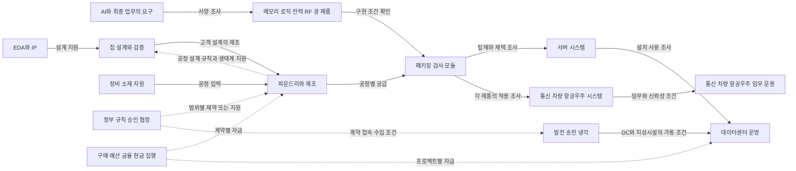

# 반도체 제품에서 산업으로 이어지는 전파 경로

점검일: **2026-10-05**. 상태: **`RESEARCH_CANDIDATE_NOT_GOVERNED_EVIDENCE`**.

반도체·AI를 중심으로 산업·섹터·기업이 연결되는 골격은 이미 있지만, 제품별 분기와 정책·협정·항공우주까지 이어지는 경로를 같은 기준으로 읽는 작업은 부족했다. 이 문서는 기존 연결을 점검하고 **어떤 변화가 무엇을 통해 전달되며, 어느 조건에서 연결이 끊기거나 달라지는지** 정리한다. 하이닉스 영업·마케팅·상품기획·신제품사업화에서 고객 요구, 구매 시점과 공급 조건을 설명하기 위한 학습 자료다.

[거시 분류](semiconductor_macro_structure.md), [AI와 메모리 요구](ai_technology_memory_links.md), [기존 지도](../../../data/research/semiconductor_supply_chain/2026-10-03/supply_chain_map_v3.json)를 함께 읽는다. 세계 모든 거래·공장·규제의 완성 지도나 검증된 충격 전파 모델은 아니다. 직접 확인한 제품·관계·절차와 우리의 조건부 설명을 각 연결에서 구분한다.

## 기존 자료에서 연결된 것과 빠진 것

2026-10-03 지도에는 주체 69개, 관계 58개, 대표 경로 6개가 있다. 이 숫자는 당시 후보 스냅샷의 구조이며, 현재 모든 관계를 재확인하거나 실제 주문을 센 결과가 아니다. 이번 기록은 기존 원문·날짜·해시를 보존한 보완층이다. 중복 기업·관계를 단순히 더해 세계지도 규모로 부르지 않는다.

| 영역 | 기존에 있는 연결 | 이번 보완과 남은 공백 |
| --- | --- | --- |
| 메모리·AI | HBM–GB300, DDR5 인증·전시, SSD 활용, AI 실행 조건과 반론 | 다른 CPU·AI ASIC 플랫폼의 요구를 함께 비교. 동일 제품·실제 구매자·물량은 별도 확인 |
| 파운드리·후공정 | NVIDIA/AMD–TSMC, HBM4 협력, Amkor·검사 장비 사례 | 선단·성숙/특수 공정, 설계 도구·IP·메모리·기판·검사의 기능 분기. 생태계 참여를 거래로 승격하지 않음 |
| 전력·데이터센터 | PPA·송전·냉각·장비, 미국 NRC/LPSC 등 절차 | 대규모 부하 요금 절차와 계약·접속·운영의 구분. 개별 DC 실부하·최종 요금 적용은 공백 |
| 국가·정책 | 기업별 국가·공정과 미국 승인 사례 | 수출 허가, 규제기관 협력 MOU, 기업 간 JDA, 전력 수입 조건부 승인을 별도 관계로 기록 |
| 항공우주·통신 | Qorvo의 RF 기능 후보 | 기명 RF 증폭기와 우주용 전원 칩의 적용 범위. 특정 항공기·위성의 채택·조달·출하는 미확인 |
| 소재·자원 | 웨이퍼·가스·CMP·GaN/SiC·InP·GaAs 기능별 후보 | 원소→형태→공정/부품→제품 노출을 연결. 갈륨·희토류의 직접 고객·원산지·등급별 물량은 미확인 |
| 지리·돈 | 대표 시설·계약·금융자회사·ETF 관측 정의 | 같은 제품·시설·법인·기간의 자금 집행과 가동 연결. 기존 시설 좌표를 새 제품의 공장·DC에 복사하지 않음 |

## 제품 축과 제조 기능 축을 함께 읽는 방법

**메모리·로직·아날로그·개별소자·광소자·센서는 제품 축이고, 파운드리는 사업모델과 제조서비스 축이다.** 파운드리는 고객 설계의 로직·아날로그·RF 등 여러 제품을 제조할 수 있다. 선단/성숙이라는 공정 표현도 제품의 가격·가치·수요 시장을 대신하지 않는다. 세부 공정과 고객의 성능·전력·신뢰성·원가·공급 지속 요구를 확인한다.

| 시작점 | 상품 또는 제공하는 기능 | 이어 볼 산업과 주체 |
| --- | --- | --- |
| DRAM | HBM, DDR, LPDDR 등 서로 다른 계층·구성 | NVIDIA/AWS 가속기, Intel/Dell 서버, 모바일·PC·차량의 별도 업무. 특정 HBM 공급사를 모든 플랫폼에 배정하지 않음 |
| NAND와 저장장치 | NAND 칩, 컨트롤러·펌웨어를 포함한 SSD/UFS | Solidigm–VAST 저장 시스템, 서버·PC·모바일. 칩과 완제품의 시장 금액·주문을 합치지 않음 |
| CPU·GPU·AI ASIC | 연산·제어와 플랫폼 | NVIDIA·AMD·AWS 등 설계·서비스 역할, 파운드리·메모리·패키징. 자체 칩과 외부 GPU는 업무별 선택지 |
| 아날로그·전력 소자 | 전압 변환·전원 관리, GaN/SiC 등 용도별 소자 | TI 우주 전원, Navitas/Infineon–전력 장비 생태계. 전력용 GaN과 RF용 GaN은 다른 요구 |
| RF·광·센서 | 무선 신호·광 연결·측정 | Qorvo 위성통신/레이더용 RF, Coherent 광통신, Broadcom/Arista 네트워크. 센서는 공통 분류만 확보, 기명 신규 사례는 미수집 |
| 파운드리·패키징·검사 | 고객 설계의 웨이퍼 제조, 적층·연결·품질 검사 | TSMC·Amkor·ASE/SPIL·Advantest 등. 개별 제품의 공장·후공정 배정과 가동량은 추가 근거 필요 |
| EDA·IP·장비·소재 | 설계 도구/재사용 설계, 노광·공정 입력 | Cadence·Synopsys·Siemens EDA·Arm, ASML, 웨이퍼·가스·CMP 공급자. 3DFabric의 기명 구성은 2022년 출범 발표 범위이며 현재 모든 회원·거래로 갱신하지 않음 |

최종 시장도 분리한다. AI는 데이터센터·통신·자동차·산업·항공우주에 걸칠 수 있는 업무 태그다. 항공우주를 데이터센터 뒤에 자동으로 연결하지 않고, 우주 전원·RF·임무 연산 등 각 기능의 수요 분기로 놓는다. 현재 확보한 항공우주 근거는 제품 용도이며 특정 기체·위성·AI 탑재의 채택 사건은 아니다.

## 경로를 따라갈 때 기록할 관계

이 그림은 조사 관계다. 물리적 흐름, 사양 요구, 돈, 허가와 위험이 모두 같은 화살표 의미를 갖지 않는다. 데이터에는 **관계 유형·방향·주체 역할·전달 대상·조건·출처·시점**을 남긴다. 공급자가 고객에게 제품을 제공하는 방향과 고객 요구가 공급자에게 전달되는 방향도 구분한다. 기존 지도의 구매자→공급자 방향은 그대로 보존하며 새로운 경로의 화살표에 자동 이식하지 않는다.

하나의 긴 실제 거래를 확인하려면 중간마다 동일 상품/플랫폼, 기명 법인, 시설·국가, 기간과 채택 단계가 맞아야 한다. 공식 사례를 이어 놓았더라도 중간 구매·설치가 미확인이면 연결은 그 지점에서 멈춘다. 그래프 연결 수·중심성은 경제적 의존도나 충격 크기가 아니다.

국가 간 정부·규제기관 협력 MOU와 기업 간 공동개발/타당성 조사 JDA는 당사자와 성격이 다르므로 국가 간 협정 건수로 합치지 않는다. 협약 발표·서명, 법적 구속력·발효 여부, 시행 법령, 개별 허가와 상업 실행은 각각 필드로 둔다. 이번 MOU 발표만으로 현재의 법적 효력·수입 허가·기명 DC 배정을 판단하지 않는다.

## 실제 기업과 대표 경로

아래는 새 [제품 경로 기록](../../../data/research/semiconductor_industry_routes/2026-10-05/product_routes.json)의 12경로와 [정책·전력 기록](../../../data/research/semiconductor_industry_routes/2026-10-05/policy_infrastructure_routes.json)의 4경로를 읽는 요약이다. 화살표의 상품·용도·절차 연결은 각 원문의 범위이며, 이후 수요·공급 변화는 조건부 가설이다. 한 행의 기업들이 동일 주문·시설·기간에 참여했다고 가정하지 않는다.

| 시작점과 기명 연결 | 근거가 보여 주는 범위 | 전파를 확인하려면 더 필요한 것 |
| --- | --- | --- |
| **HBM → NVIDIA GB300 → AI 서버/클러스터** | 기존 하이닉스 HBM3E 적용·플랫폼 사양과 별도 OEM/CSP 사건. `PROD-01-HBM-GPU` | 같은 구성의 메모리 공급사·구매·설치·사용량. GB300이 커지면 모든 HBM 주문이 늘었다고 결론 내리지 않음 |
| **DDR5 → Intel Xeon 6 인증 / Dell R770 전시** | 모듈 인증과 전시 설치라는 별개 사건. `PROD-02-DDR-CPU` | 동일 모듈 SKU·실제 구매 법인·주문·출하 |
| **LPDDR5X → Grace CPU → GB300 호스트 메모리** | 해당 플랫폼의 CPU 메모리 계층. `PROD-03-LPDDR-CPU` | 제조사·하이닉스 공급 여부·주문. DDR5 서버와 용량을 혼합하지 않음 |
| **NAND → Solidigm eSSD → VAST 데이터 플랫폼** | 기명 활용 설명과 별도 공급사 시험의 조건. `PROD-04-NAND-ESSD` | 정확한 SSD SKU·실사용·주문과 NAND 공급·용량 배정 |
| **HBM3e → AWS Trainium3 → Trn3 서비스** | 공식 제품 페이지의 칩당 메모리 사양. `PROD-05-HBM-ASIC` | HBM 공급사·현 파운드리·패키지·설치량. 2022 Trainium 협력을 Trainium3로 승계하지 않음 |
| **고객 설계 → TSMC 제조서비스 → 선단/성숙·특수 공정** | 2025 연차보고서의 기술·사업 범위. `PROD-06-FOUNDRY-NODES` | 고객 SKU·공정·공장·현재 생산/배정. 특정 TI/Qorvo 칩의 제조사로 TSMC를 넣지 않음 |
| **EDA/IP → 설계·패키지 → HBM·기판·OSAT·검사** | TSMC의 **2022-10-27** 3DFabric 출범 발표에 기재된 기능·기업. `PROD-07-EDA-IP-PACK-TEST` | 현재 회원·실제 설계 도구·IP·외주·검사 장비의 동일 제품 관계 |
| **ASML 노광 / 웨이퍼·가스·CMP → 공정 → 메모리·로직** | EUV·DUV의 공정 층별 기능과 기존 소재 후보. `PROD-08-EQUIPMENT-MATERIALS` | 공정·장비/재료 형태·시설별 구매·설치·인수·실제 투입 |
| **Navitas / Infineon–Eaton → GaN/SiC 전력 변환 → DC** | 기존 아키텍처 협업·전력 장비의 기능 연결. `PROD-09-GAN-SIC-POWER` | 기명 랙/전력 장비 BOM·제품 납품·설치. 협업을 주문량으로 바꾸지 않음 |
| **Marvell–AWS / Coherent–NVIDIA → 광·네트워크 → AI 연결** | 기존 Marvell–AWS의 여러 제품 세대 협력과 Coherent–NVIDIA의 구매약정·미래 capacity 권리. `PROD-10-OPTICAL-INTERCONNECT` | 동일 시스템의 광 모듈/칩·납품·사용. 협력과 구매약정을 특정 칩 BOM·실제 주문으로 승계하지 않음 |
| **Qorvo QPA0524 → RF 증폭 → 5G·위성통신·레이더** | 제품 용도 설명. `PROD-11-GAN-RF` | 기명 시스템·인증·조달·실제 비행 채택. 본문 수치 상충을 보존해 성능 비교는 제외 |
| **TI TPS7H4001-SP → ASIC/FPGA 전원 → 우주 전자장치** | 방사선 대응 전원 제품과 적용 설명. `PROD-12-SPACE-POWER` | 특정 위성·기체·임무·구매자·납품. 민항전자 전체나 상용 메모리의 우주 인증은 미확인 |
| **AWS–Talen PPA / PPL 전달 → 전력·가동 조건** | 기존 2025 계약 참조와 2026Q2 전문의 전환 설명을 구분. `ROUTE-PI-01` | 실제 수전·부하·개별 송전 계약·같은 DC의 칩 구매. SEC 원문 재캡처 실패를 숨기지 않음 |
| **FERC → PJM show-cause → 후속 송전서비스·요금 절차** | **2026-06-18, EL26-67-000** 명령의 절차·관할 범위. `ROUTE-PI-02` | 후속 결정·시행·경과조치·기명 고객/서비스 적용. 개별 DC 승인이나 전국 최종 규칙으로 부르지 않음 |
| **BIS VEU 항목 삭제 / C79 신고 → 특정 fab 장비 조건** | **2025-09-02** 규칙에 표기된 **2025-12-31** 시행일과 **2026-01-05** 신고 안내. `ROUTE-PI-03` | 현행 품목·허가·법인·시설·장비 인수. VEU 삭제를 모든 중국 메모리 생산 중단으로 일반화하지 않음 |
| **EMA–ST MOU / SGEI·SP·TNB JDA / EMA 조건부 수입 승인** | **2020 규제기관 협력**, **2026 발표의 기업 타당성 조사**, **2026-08-07 수입 조건부 승인**을 분리. `ROUTE-PI-04` | MOU 효력·JDA 전문·최종 허가·PPA·금융·연계/발전 시설·실제 MWh·기명 DC. 세 사건 사이의 인과는 미확인 |

기술·제품 자료의 날짜와 현행 지원은 원문별로 다르다. TSMC 연차보고서는 2025 보고 범위, 3DFabric은 2022 출범 사건, 정적 제품 페이지는 이번에 본 버전이다. 최초 공개일·현재 생산 능력·법적 효력·고객의 실제 이용을 이 기준일로 대신하지 않는다.

## 여러 경로를 이어 붙이는 확인 지점

| 이어 볼 경로 | 공통점을 넘어 확인할 키 | 현재 연결 상태 |
| --- | --- | --- |
| HBM·GPU/ASIC ↔ 파운드리·후공정 ↔ 서버 | 같은 플랫폼 세대·다이/패키지·메모리 SKU·제조/통합 법인 | 요구와 기능 연결은 설명 가능. Trainium3의 제조·HBM 공급자 등 실제 구성은 공백 |
| 서버·메모리 ↔ DC ↔ PPA·계통·요금 | 같은 DC 프로젝트·고객 법인·칩 구매/설치·전력 계약·접속 문서·기간 | 별개 사례의 조건부 연결. AWS 이름의 일치만으로 모든 Trainium3와 Talen 전력을 연결하지 않음 |
| 국가 간 전력 협력 ↔ 개발·수입 ↔ DC | 같은 협정/프로젝트, 허가·개발 상태, buyer·실제 flow·시설 | 규제기관 MOU·JDA·조건부 승인 사이의 인과·같은 DC 구매는 미확인 |
| 수출규칙 ↔ 장비·fab ↔ 메모리 고객 | 같은 품목·end-use·허가·법인·공장·공정·고객 상품 | 법적·장비·공급 준비의 조사 경로. 생산량·고객 납기에 준 효과는 미측정 |
| 소재·전력/RF ↔ 통신·항공우주 | 원소·화합물·형태·등급·부품/공정·기명 시스템 | GaN이라는 공통점만으로 전력용·RF용 조달을 합치지 않음. 원산지·직접 구매·임무 채택은 공백 |

갈륨·희토류의 국가별 현행 수출통제, 센서·민항·자동차의 기명 채택, 국가별 실제 시설·고객 거래의 전수 연결은 **미검토 또는 미완성**이다. 지도가 관계를 탐색할 수 있다는 것과 각 경로의 영향이 실제로 관측됐다는 것은 구분한다.

## 전파를 설명하는 네 가지 질문

| 전파 방향 | 조건부로 조사할 설명 | 멈추거나 달라지는 조건 |
| --- | --- | --- |
| 업무 요구가 공급망으로 | 업무·모델 변화→필요 메모리/연산·I/O→플랫폼 사양→인증·구매→제조·후공정 요구 | 소프트웨어 효율·기존 장비 활용·다른 플랫폼·재고 조정·구매 미확인. 요구 증가가 주문 증가를 보장하지 않음 |
| 공급 제약이 고객으로 | 장비·소재·제조·검사 차질→해당 제품 공급 준비→OEM 납기→설치·사용 일정 | 다른 공장·공급자·제품 대체, 안전 재고, 별도 병목. 회사 전체 능력을 고객별 유효 공급으로 쓰지 않음 |
| 전력·정책이 설치·생산으로 | 요금·허가·수입/수출 조건→기명 프로젝트 비용·일정/공정 접근→채택·가동 조건 | 법적 적용 범위·예외·후속 허가·금융조달·계통·기술 검증. 승인이나 MOU가 실제 공급 개시를 뜻하지 않음 |
| 돈이 실행으로 | 예산·민간 계약·대출 약정→인출·현금 지급→장비 인수·건설→운영·수익 회수 | 약정 미인출·취소·선급/리스·회계 범위·시설 배정 공백. ETF 거래와 공급사 자금 수취도 구분 |

전파의 방향·크기·시차는 추정하지 않았다. 가설을 확인할 결과는 **같은 상품의 인증·주문·납품·설비 인수·기명 시설 가동·실제 사용·현금 집행** 중 하나로 좁힌다. 다른 기업의 거시 지표와 합쳐 임의 전환율이나 선행 개월을 만들지 않는다.

## 무료 관측과 연결 키

| 무엇을 왜 볼 것인가 | 최소 연결 키와 단위 | 무료 경로와 실제 확인 범위 |
| --- | --- | --- |
| 제품·업무 요구: 무엇을 팔아야 하는가 | 상품/SKU·플랫폼·문서 버전·업무·정밀도·메모리 계층·원 사양 단위 | 공식 제품·개발 문서, 고객 지원표, 시험 공개 결과. 이번에는 원문과 사례를 확인; 새 고객 실측·전체 시험 데이터는 미수집 |
| 인증·채택·주문: 요구가 구매로 이어졌는가 | 제품×플랫폼×법인/역할×사건일×공개일×원 단계 | 기업 뉴스·IR·SEC/DART 공시. 공식 무료 웹/PDF 중심; DART 키와 SEC 정책은 [기존 접근 계획](collection_plan.md) 참조. 특정 주문 수량이 없으면 null |
| 공정·장비·소재: 어디서 공급이 결정되는가 | 공정/층·재료 형태·장비 모델·시설·법인·설치/인수 단계·기간 | 제조사·장비/소재사 공식 자료와 시설 공시. 장비 출하와 인수, 웨이퍼 구경·능력과 제품별 배정 구분 |
| 전력 준비: 설치가 실제 가동될 수 있는가 | 부하 프로젝트·발전소/계통·PPA/요금/접속 문서·고객 법인·MW 정의·MWh 측정 기간 | 유틸리티 공시·FERC/지역 규제기관 문서·EIA 공개 파일. 이번 기명 발표·절차 확인을 미터 부하 수집으로 표시하지 않음 |
| 정책·협정: 어디에 어떤 조건이 적용되는가 | 관할·문서/사건 ID·품목/공정·수출입국·주체·발표/발효/신청/허가일·예외 | 규제·정부 공식 원문과 협정 발표. 공개 PDF/HTML 무키; 일부 사이트 자동 접근 실패는 별도 기록. 모든 국가의 최신 통합 법령·개별 허가 조회는 미실행 |
| 자금·실행: 누가 비용을 부담하고 지급했는가 | 계약/프로젝트×법인×기간×통화×약정/인출/현금/리스 구분 | 공시·IR·공개 조달·프로젝트 자료. 회사 전체 CAPEX를 특정 상품·시설·메모리 구매로 배분하지 않음 |

사건·문서 개정마다 확인하고 제품/정책/시설 목록의 정기 변경 여부를 살피는 주기는 **수집 제안**이다. 반복 수집기나 모니터를 구현한 상태가 아니다. 무료 열람·API 호출 성공·과거 데이터·재배포 권리는 따로 확인한다. 무역은 HS/HTS 판·형태·reporter/partner·기간·flow·수량 단위를 남기고 생산량 대용치의 한계를 보존한다.

## 하이닉스 직무 질문으로 돌아오기

영업은 사양 결정자·검증자·통합자·구매자·사용자를 구분하고 고객의 구매/설치 일정과 납기를 연결한다. 마케팅은 용량·대역폭·I/O·전력·신뢰성 중 고객이 원하는 가치를 같은 업무 조건에서 비교한다. 상품기획은 메모리 계층·폼팩터·인터페이스와 다른 칩·공정의 제약을 함께 본다. 신제품사업화는 샘플·인증·탑재·주문·출하와 제조·후공정·전력·정책의 남은 관문을 확인한다.

항공우주·국제 전력·비메모리 공정으로 확대하는 이유는 고객 요구와 공급 조건이 다른 산업을 통해 바뀌는 경로를 이해하기 위해서다. 그 산업의 회사 이름을 늘리거나 모든 제품이 하이닉스 매출로 이어진다고 설명하기 위해서가 아니다. 실제 고객 공백을 확인한 뒤 기명 상품 사례로 다시 좁힌다.

## 경로 자료와 검토

대표 제품 경로와 정책 사례는 [제품·제조·항공우주 기록](../../../data/research/semiconductor_industry_routes/2026-10-05/product_routes.json), [정책·전력 기록](../../../data/research/semiconductor_industry_routes/2026-10-05/policy_infrastructure_routes.json)에 저장한다. [통합 인덱스](../../../data/research/semiconductor_industry_routes/2026-10-05/route_index.json)와 [manifest](../../../data/research/semiconductor_industry_routes/2026-10-05/manifest.json)는 분류·연결 조건·파일 경계를 기록한다. 신규 원문 캡처와 기존 참조, 기술 용도·생태계 참여·민간 계약·정부 절차·조건부 전파를 구분한다.

[독립 목적 검토](research_convergence_review.md)는 필요한 발산과 상품·고객 질문으로의 수렴을 점검한다. 신규 공개 파일은 원문 전체·개인 연락처·키·비공개 저장소 자료를 포함하지 않는다. H1/Gate 6·정식 Evidence 승인·예측력·인과 판정은 이 조사로 바뀌지 않는다.

**다음 작업 하나:** 이 산업 경로 안에서 서버 DDR5–Intel Xeon 6–Dell R770 고객·상품 카드를 작성해 요구 사양·각각의 인증/전시·동일 SKU·실제 구매자의 공백을 구분한다.
