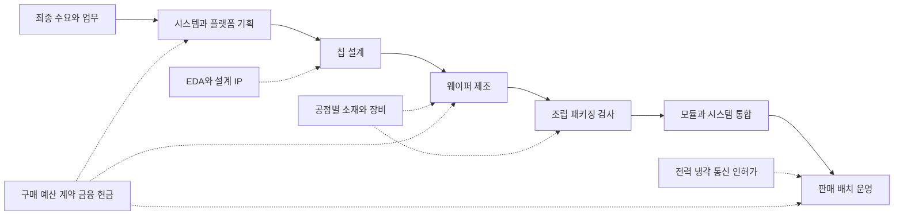

# 하이닉스 관점의 반도체 산업 거시 구조

기준일: **2026-10-04**. 상태: **`RESEARCH_CANDIDATE_NOT_GOVERNED_EVIDENCE`**.

이 문서는 반도체 산업을 **제품 × 사업모델 × 공정 × 수요시장 × 지역**으로 나누고, 하이닉스의 상품과 고객 관계를 그 안에 배치하는 학습 기준판이다. 영업·마케팅·상품기획·신제품사업화에서 “어떤 고객의 어떤 문제를 어떤 상품으로 해결하며, 공급과 구매 시점을 무엇으로 확인하는가”를 설명하는 데 사용한다.

기존 지도는 AI·HBM을 포함한 대표 관계를 갖고 있었다. 이번 기준판은 산업 전체의 분류와 비교 기준을 보완한다. **학습 구조의 정리, 현재 관측값의 수집, 선행성 검증은 별개 상태**다. 세계 모든 기업·공장·거래를 수집했다는 뜻은 아니다. 아래의 수요 연결과 조사 순서는 우리의 학습 설계이며, 특정 고객의 주문이나 인과효과를 확인한 결과가 아니다.

함께 읽을 문서: [메모리 사이클과 지표 수집 계획](memory_cycle_signal_plan.md), [하이닉스 직무와 상품](sk_hynix_commercial_role_context.md), [HBM3E와 GB300 사례](customer_product_cards/hbm_nvidia_gb300.md).

## 분류와 공정의 전체 그림

아래 그림은 산업 기능의 연결이다. 화살표는 특정 기업의 계약이나 지급을 증명하지 않는다. 실제 거래는 별도의 기명 근거로 연결한다.



OECD는 설계, 웨이퍼 제조, 조립·검사·패키징을 핵심 단계로 구분하며 EDA·IP, 소재·장비와 이후의 전자제품 생산을 연결한다. 사업모델은 이 기능 중 무엇을 수행하고 누구에게 무엇을 판매하는지를 설명한다. **SRC-MACRO-OECD-MAPPING25 / SRC-MACRO-OECD-MODELS26**.

| 축 | 답할 질문 | 같은 축에서 비교할 것 | 혼합하면 생기는 오류 |
| --- | --- | --- | --- |
| 제품 | 무엇을 만드는가? | 메모리·로직·아날로그 등 같은 분류 수준 | Memory와 Foundry를 서로 배타적인 제품으로 합산 |
| 사업모델 | 어떤 기능을 직접 수행하고 판매하는가? | IDM·팹리스·파운드리·OSAT·EDA/IP | 한 회사의 복수 기능을 하나의 고정 역할로 처리 |
| 공정 | 어느 단계의 어떤 능력이 필요한가? | 설계, 전공정, 패키징, 검사와 입력 | 공장 증설을 완성 제품 출하량으로 대체 |
| 수요시장 | 어떤 시스템·업무가 사용하는가? | 컴퓨터·통신·자동차 등과 AI 적용 여부 | AI·서버·데이터센터를 중복 없는 시장처럼 합산 |
| 지역 | 어느 위치의 무슨 활동인가? | 본사, 공장, 패키징, 판매지역, 교역국 | 본사 국가의 매출을 그 국가의 생산으로 해석 |

## 제품 분류와 하이닉스의 위치

상위 분류는 WSTS Spring 2026의 구분을 사용한다. 보고서의 `Micro`와 `Logic`을 보존한다. 다른 기관의 합산 분류를 가져오면 분류판과 변환 규칙을 함께 기록한다. **SRC-MACRO-WSTS-SPRING26**.

| 분류 수준 | 산업의 제품 범위 | 하이닉스 학습에 연결할 내용 |
| --- | --- | --- |
| IC 안의 Memory | DRAM·NAND 등을 아래 단계로 구분 | 하이닉스의 메모리 사업을 놓을 상위 시장. 전체 Memory 금액이 HBM 금액은 아님 |
| Memory 아래 DRAM | HBM·DDR·LPDDR·GDDR 등 상품 계열 | HBM, 서버 메모리, 저전력 메모리의 고객·사양·채택 과정 비교 |
| Memory 아래 NAND | 비휘발성 저장용 반도체 | NAND 칩과 NAND를 사용하는 eSSD·cSSD·UFS 완제품을 다른 상품 단위로 기록 |
| IC 안의 Logic | 연산·제어 등 로직 분류 | GPU·자체 AI ASIC의 플랫폼 요구가 어떤 메모리 계층과 연결되는지 조사 |
| IC 안의 Micro | WSTS가 별도 집계하는 Micro 분류 | CPU 중심 서버 플랫폼과 메모리 호환성. 다른 자료의 로직 합계와 비교 시 범위 확인 |
| IC 안의 Analog | 아날로그 신호 처리 등의 분류 | 전원·신호 등 시스템 기능과 연결. 전력반도체 전체와 동일한 집계로 취급하지 않음 |
| IC 밖의 제품 | Discrete, Optoelectronics, Sensors | 전력 변환·광통신·센서 등 주변 수요를 기능별로 조사 |

하위 제품과 사용 목적의 연결은 [회사 제품 근거 SRC-HY26-PORTFOLIO](../../../data/research/sk_hynix_commercial_context/2026-10-03/sources.json)와 기존 상품 학습 노트에 따른다. **HBM은 DRAM의 상품 계열**, SSD는 NAND 외에 컨트롤러·펌웨어 등으로 구성된 저장장치다. 같은 가치사슬의 NAND 판매와 SSD 판매를 단순히 더해 하나의 칩 시장규모로 만들지 않는다.

HBM·서버 DRAM·eSSD를 우선 자세히 보고, 모바일·PC를 산업 수급 배경에 포함한다. 회사가 사용하는 AI-DRAM·AI-NAND 표현은 상품 전략의 표현이며, 모든 관측기관이 공유하는 독립 통계 분류로 가정하지 않는다. HBF·CXL·PIM·custom HBM은 기술·규격·구현·성숙 단계를 각각 확인하는 후속 항목이다.

## 사업모델과 공정에서 생기는 고객 관계

아래 사업모델 정의는 OECD의 구분을 학습용으로 요약했다. 돈의 항목은 찾아볼 거래 형태이며 각 회사의 실제 계약·매출 구성은 별도 원문이 필요하다. **SRC-MACRO-OECD-MODELS26**.

| 사업모델이나 기능 | 수행하는 일 | 누가 어떤 이유로 고객이 되는가? | 찾아볼 거래와 공급 조건 |
| --- | --- | --- | --- |
| IDM | 칩 설계와 제조를 통합 | 제품을 채택하는 플랫폼·시스템 기업 | 제품 판매, 인증·납기·품질. 일부 공정 외주 가능 |
| 팹리스 | 칩을 설계하고 제조를 외부에 맡김 | 플랫폼·전자제품·운영 사업자 | 칩·플랫폼 판매; 제조·패키징은 다른 공급자 이용 |
| 파운드리 | 고객 설계를 위탁 제조 | 설계 기업·외주 제조를 이용하는 IDM | 공정 접근, 웨이퍼 제조, 제품별 생산 준비 |
| OSAT | 외주 조립·패키징·검사 | 팹리스·IDM 등 | 패키징·검사 서비스, 생산 준비와 납기 |
| EDA와 설계 IP | 설계 소프트웨어와 재사용 가능한 설계 자산 제공 | 설계·제조·시스템 기업 | 도구·IP 이용 계약; 고객 개발 단계와 일정 |
| 장비와 소재 공급 | 공정에 필요한 설비·입력 제공 | 제조·패키징·검사 사업자 | 장비 주문·인도·인수, 소재 구매·인증 |
| OEM·ODM과 통합 | 칩·메모리·부품으로 시스템 구성 | 운영자·기업·소비자 | 시스템 판매·지원, 부품 호환성과 공급 |
| 시스템·클라우드 운영 | 시스템을 설치·운영하고 서비스 제공 | 서비스 이용자 | 장비 구매·리스·서비스 매출; 자체 칩 설계도 가능 |

**회사는 관계마다 고객이자 공급자다.** 메모리 공급자는 소재·장비·외주 공정의 고객이고 플랫폼 기업의 공급자다. 플랫폼 기업은 설계 IP·제조 서비스의 고객이며 OEM·운영자에 플랫폼을 제공할 수 있다. 기명 구매자, 사양 결정자, 인증자, 시스템 통합자, 사용자는 다를 수 있다. 회사 이름 옆에 역할 하나를 고정하지 않는다.

| 공정 구간 | 필요한 입력과 산출 | 하이닉스 관점에서 확인할 질문 |
| --- | --- | --- |
| 설계와 검증 | EDA/IP, 아키텍처·인터페이스·설계 → 검증된 설계 | 고객 플랫폼과 요구 사양을 언제 고정하는가? |
| 전공정 | 웨이퍼·가스·화학물질·공정 장비 → 웨이퍼 위 다이 | 투입량, 공정 전환, 수율과 비트 밀도 중 무엇이 공개되는가? |
| 패키징과 검사 | 기판·접합·적층·검사 → 패키지 제품 | 웨이퍼 능력 외에 적층·패키징·검사 제약이 있는가? |
| 모듈과 저장장치 | 메모리·컨트롤러·기판·펌웨어 → 모듈·SSD | 다이와 모듈 사양, 인증·시스템 호환성은 어떻게 다른가? |
| 배치와 운영 | 서버·네트워크·전력·냉각 → 서비스 사용 | 출하된 장비가 설치·수전·실제 이용까지 이어졌는가? |

일반 공정 입력은 **SRC-MACRO-OECD-MAPPING25**에 따른다. 개별 상품의 구현·외주 범위는 해당 제품 근거로 확인한다. 샘플, 고객 인증, 설계 채택, 양산 준비, 상업 출하를 같은 사건으로 정규화하지 않는다.

## 수요시장과 AI의 연결

SIA 2025 Factbook의 수요시장 구분을 공통 뼈대로 사용한다. **Computer, Communications, Automotive, Consumer, Industrial, Government**다. AI는 이들 시장에 걸칠 수 있는 업무·기술의 추가 태그로 둔다. SIA의 과거연도 시장표를 2026 현재 구성비로 인용하지 않는다. **SRC-MACRO-SIA-FACTBOOK25**.

아래 연결은 제품별로 조사할 질문이다. 특정 시장의 현 수요 증가나 고객 채택을 확인한 표가 아니다.

| 수요시장 | 실제 시스템과 업무의 예 | 메모리에서 조사할 변수 | 고객과 선행 사건 후보 |
| --- | --- | --- | --- |
| Computer | 서버·데이터센터·PC | 시스템 출하 × 제품별 탑재 용량, 대역폭·저장 I/O | 플랫폼 세대, OEM 인증·구성, 구매·배치 일정 |
| Communications | 스마트폰·통신 장비 | 제품 세대·등급별 DRAM/NAND 구성, 판매·재고 | 기기 출시, 부품 채택, 통신 설비 투자 |
| Automotive | 차량 연산·정보·제어 시스템 | 사용 목적별 메모리, 신뢰성·인증 조건 | 설계 채택과 고객 검증의 기간·단계 |
| Consumer | 가전·게임 등 소비자 기기 | 기기 단위와 메모리 구성, 유통 재고 | 신제품·판매 속도·주문 수정 |
| Industrial | 산업 장비·자동화 등 | 제품 수명, 신뢰성·공급 지속 조건 | 고객 투자·장비 주문·설계 변경 |
| Government | 정부·공공 분야의 시스템 수요 | 실제 사업·제품·조달 범위 | 예산·조달·계약·납품과 승인 조건 |

**AI 수요는 상품별 사용 문제로 다시 나눈다.** 가속기 가까운 HBM, CPU 시스템 메모리, 데이터·체크포인트·검색 등을 위한 저장장치는 서로 다른 계층이다. 학습·추론·RAG 같은 업무의 이름만으로 특정 상품 구매량을 계산할 수 없다. 사용량, 모델 구성, 시스템 설계, 실제 설치와 구매의 연결이 필요하다. 기존 HBM 카드의 기술 설명과 Solidigm의 조건부 시험 사례를 함께 읽는다. **SRC-HBM-NV-INFERENCE / SRC-HY26-SSD-WORKLOAD**.

## 실제 기업을 이 구조에 놓는 방법

다음 사례는 회사가 산업 안에서 하는 일을 이해하기 위한 것이다. 앞 표는 기존 원문 영수증으로 확인한 발표 범위, 뒤 표는 기존 지도에서 재사용할 연구 후보를 표시한다. 표의 이웃 행이 서로의 공급계약을 뜻하지 않는다.

| 주체 | 기존 근거가 보여 주는 기능이나 사건 | 고객 관점의 의미 | 근거와 범위 |
| --- | --- | --- | --- |
| SK hynix | HBM·DRAM·NAND 기반 상품 전략 | 고객 문제를 상품·사양·공급 조건으로 번역 | SRC-HY26-PORTFOLIO; 고객별 수량·가격 미확인 |
| Solidigm | VAST의 SSD 활용을 설명하는 고객 사례 | 장치 사양을 시스템 비용·공간·전력 가치와 연결 | SRC-HY26-VAST; 공급사 사례의 조건 보존 |
| NVIDIA | GB300 플랫폼과 HBM 관련 사양 | 사양·아키텍처 결정과 최종 사용 역할 분리 | SRC-HBM-NV-PRODUCT / NV-DATASHEET; 구매자·지급자 미확인 |
| Intel | 하이닉스 DDR5의 Xeon 6 플랫폼 인증 발표 | 플랫폼 호환성·검증이 필요한 이유 | SRC-HY26-INTEL; Intel 구매를 입증하지 않음 |
| Dell | 전시 R770 시스템의 인증 메모리·SSD 탑재 | OEM 통합과 개별 부품 인증의 연결 | SRC-HY26-DELL; 전체 출하·채택 범위 미확인 |
| Meta | 서버 DRAM·eSSD 공급 및 별도 AI 협력 발표 | 운영자의 구매 요구와 자체 칩 개발 요구 구분 | SRC-HY26-META; 특정 MTIA의 HBM 주문 미확인 |
| AWS | GB300 기반 EC2 서비스의 제공 개시 | 플랫폼 출하 이후 운영 서비스 단계 관측 | SRC-HBM-AWS; 이용률·하이닉스 직접 구매 미확인 |
| Supermicro | Blackwell Ultra 시스템 양산 출하 발표 | OEM 시스템 공급의 상업 단계 | SRC-HBM-SUPERMICRO; HBM 공급사 미확인 |
| TSMC | 하이닉스와 HBM4 기술 협력 발표 | 메모리·로직 공정·패키징의 경계 연결 | SRC-HBM-TSMC-MOU; GB300 개별 제조라인 근거가 아님 |

원문 영수증: [하이닉스 직무·상품 sources](../../../data/research/sk_hynix_commercial_context/2026-10-03/sources.json), [HBM sources](../../../data/research/customer_product_cards/hbm_nvidia_gb300/2026-10-03/sources.json). 각 날짜와 주장 범위는 원래 영수증을 따른다.

| 공정이나 주변 기능 | 기존 지도에서 이어 볼 기업 | 재사용할 관계 ID와 추가 확인 |
| --- | --- | --- |
| 외주 패키징 | Amkor | `semi-rel-06`, `semi-rel-07`; 고객·제품·시설·계약 단계 |
| 노광·공정 제어·검사 | ASML, KLA, Advantest | `semi-rel-11`, `semi-rel-09`, `semi-rel-12`, `v3-nvidia-advantest`; 협력 발표를 장비 주문으로 바꾸지 않음 |
| 실리콘 웨이퍼 | GlobalWafers, SUMCO | `mn-globalwafers-micron-supply`, `mn-sumco-silicon-substrate`; 예정 계약과 현행 IR 확인 구분 |
| 가스·공정 소재 | Linde, Entegris | `mn-linde-samsung`, `mn-entegris-cmp`; 기명 하이닉스 직접 공급은 미확인 |
| 네트워크 | Broadcom, Arista | `v3-arista-broadcom`; 반도체 공급과 시스템 통합 기능 구분 |
| 전력 변환 | Infineon, Eaton | `mn-infineon-eaton`; 전력소자와 이를 쓰는 장비 기능 구분 |

이 표는 [기존 후보 지도](../../../data/research/semiconductor_supply_chain/2026-10-03/supply_chain_map_v3.json)의 탐색용 연결이다. 이전 출처 검토 상태와 날짜를 그대로 유지하며 새 완전한 Source 영수증이나 사람의 Evidence 승인으로 승격하지 않는다. EDA/IP 사업자는 OECD의 기능 분류로 포함했으나 개별 공급자 비교표는 아직 작성하지 않았다. 기존 `v3-marvell-aws-eda`는 클라우드 설계 인프라 사용 사례이지 EDA 업체 전체 산업구조를 대표하지 않는다.

## 지역 지도와 소재 위험을 연결하는 기준

국가별로 기업 목록 하나를 만드는 방식으로는 생산·판매·공급 위험을 구분하기 어렵다. 아래는 세계지도의 필드 설계이며, 현재 모든 국가의 값을 채운 표는 아니다. **SRC-MACRO-OECD-MAPPING25 / SRC-MACRO-OECD-CAPACITY25 / SRC-MACRO-SIA-FACTBOOK25**.

| 지역 관측층 | 필요한 연결 키와 단위 | 읽을 수 있는 내용과 한계 |
| --- | --- | --- |
| 본사·법인 | 법인 ID, 본사 국가, 관계 유효기간 | 기업 소속·계약 주체. 생산국·고객 사용국을 대체하지 않음 |
| 전공정 공장 | facility ID, 제품·공정, 가동 상태, 웨이퍼 구경, WSPM 기준 | 월 웨이퍼 능력. 200mm·300mm·8인치 환산을 구분하고 특정 상품 배정은 별도 확인 |
| 패키징·검사 | 시설·공정·제품, 계획/가동, 원문 처리 단위 | 첨단 패키징이라는 이름만으로 HBM·CoWoS 능력을 합산하지 않음 |
| 판매·수요 지역 | 통계 기관의 지역 정의, 제품, 금액·기간 | 칩 판매 지역은 공장 소재국·최종 소비국과 다름 |
| 국가 교역 | reporter/partner, HS 판·품목, flow, 금액·수량·순중량 | 국경 이동. 재수출·가공·반복 이동·국내 거래 누락으로 생산량과 다름 |
| 운영 시설·전력 | DC/건물/발전소 ID, 소유·운영·사용 역할, MW/MWh 정의 | 설치·수전·실제 부하를 구분. 본사나 발전소 좌표를 고객 DC로 복사하지 않음 |

OECD의 공장 지도는 가동·건설·계획 시설을 구분하고 8인치 환산 월 웨이퍼 능력 등을 사용한다. 해당 보고서의 입력 중 유료 자료가 있으면 무료 원문 열람을 원천 데이터 접근으로 확대하지 않는다. 같은 시설이 복수 제품·공정을 지원해도 각 범주에 전부 배정한 능력을 서로 더하지 않는다. **SRC-MACRO-OECD-CAPACITY25**.

소재는 **원소 → 재료·형태 → 공정 또는 부품 → 시스템 기능 → 상품·고객 영향**을 확인한 뒤 붙인다. 기존 지도는 실리콘 웨이퍼·가스·CMP와 GaN/SiC 전력, InP 광통신, GaAs RF를 기능별 후보로 구분했다. 갈륨·희토류를 이름만으로 하이닉스 DRAM의 직접 투입재로 넣지 않는다. 어떤 공정·장비·부품의 노출인지, 대체재·공급자 인증·지역 통제 조건이 무엇인지 근거가 필요하다.

무역 코드도 형태별 범위를 확인한다. 예를 들어 기존 OECD 검토는 HS 2017의 `811292`가 갈륨만의 품목이 아님을 기록했다. 이 코드 전체 변화는 갈륨만의 생산량·구매량이 아니다. 현재 판과 세부 국가 코드는 수집 전에 다시 확인한다. [기존 OECD 방법론 검토](../../../data/research/semiconductor_supply_chain/2026-10-03/source_benchmark_v2.json)의 `oecd-semiconductor-map-2025`를 참고한다.

## 시장규모와 경쟁을 비교하는 기준

같은 날짜·제품·단위·분모의 표부터 만든다. 아래는 **WSTS Spring 2026 발표본의 제한된 시장규모 기준값**이다. 단위는 **백만 US달러**, 발표일은 **2026-06-02**, locator는 **PDF 2쪽 WSTS Forecast Summary**다. 2025는 이 발간본의 과거연도 값이고 2026는 예측이다. 현재 10월 실적·최신 전망으로 바꾸어 부르지 않는다. **SRC-MACRO-WSTS-SPRING26**.

| WSTS 구분 | 2025 과거연도 값 | 2026 예측 |
| --- | ---: | ---: |
| 세계 반도체 전체 | 795,640 | 1,511,248 |
| Memory | 230,042 | 803,941 |
| Logic | 299,547 | 411,371 |
| Analog | 86,519 | 95,358 |

부분 범주만 발췌했으므로 아래 세 행의 합은 세계 전체가 아니다. 이 Memory는 DRAM·NAND·HBM별 표가 아니며, 금액 변화에는 가격과 상품 구성의 영향이 섞인다. 시장 금액의 증가율을 생산 비트 증가율이나 하이닉스 고객 주문 증가율로 쓰지 않는다.

**무료 월별 현황 경로도 있다.** WSTS Historical Billings는 로그인 없는 Excel/PDF로 월별 총액과 3개월 이동평균, Americas·Europe·Japan·Asia Pacific·Worldwide를 제공한다. 제품별 상세 통계·DRAM/NAND 단가·출하 비트가 포함된 파일로 설명하지 않는다. 접근·파일 스키마 확인과 실제 시계열 저장은 아래 상태표에서 구분한다. **SRC-MACRO-WSTS-HISTORY / SRC-MACRO-WSTS-HISTORY-XLSX**.

확인한 July 2026 파일의 `Monthly Data!H250`은 Worldwide 2026년 7월 **142,480,424**, 원 단위는 **1,000 US달러**다. 이 값 하나는 파일 정의를 확인한 기준값이며 전체 과거 시계열을 적재한 결과가 아니다. `3MMA` 시트의 이동평균과 섞거나 위의 연간 전망과 같은 기간의 실적으로 비교하지 않는다. 상세 제품별 월자료 구독은 별도 서비스다. **SRC-MACRO-WSTS-HISTORY-XLSX / SRC-MACRO-WSTS-SUBSCRIPTION**.

경쟁 비교는 삼성전자·Micron 등을 기존 학습 노트의 비교 후보로 두고 **상품군 → 고객 플랫폼 → 공개 사양 → 인증·출하 단계 → 같은 기간의 경제지표**로 좁힌다. 전체 DRAM 매출 점유율, HBM 매출 점유율, 특정 고객의 공급 비중, 출하 비트 비중은 서로 다른 분모다. 현재 동일 분모·시점의 경쟁사 시장점유율 표는 **`TO_VERIFY`**이며 수치를 만들지 않았다.

## 수급과 돈의 흐름에서 확인할 사건

메모리 수요는 기기·시스템 수량과 시스템당 메모리 구성, 사용 업무를 함께 본다. 공급은 웨이퍼 투입·공정·수율·비트 밀도·상품 구성과 패키징·검사 준비를 따로 본다. 매출 금액, 물리적 비트, 웨이퍼 능력은 같은 관측값이 아니다. 상세 측정 계약과 선행 가설은 [메모리 사이클과 지표 수집 계획](memory_cycle_signal_plan.md)에 있다.

```text
수요 관측: 업무·서비스 사용 ↔ 시스템 구성·출하 ↔ 구매·재고 조정
공급 관측: 소재·장비 ↔ 웨이퍼·공정 전환 ↔ 패키징·검사 ↔ 상업 출하
경제 관측: 가격·구성 ↔ 매출·재고 ↔ 투자 계획·현금 CAPEX ↔ 다음 공급
```

양방향 표시는 서로 확인해야 하는 관련 변수다. 고정된 시차·인과 방향이나 모든 제품이 같은 사이클을 가진다는 주장이 아니다. 예컨대 HBM 공급 제약과 범용 DRAM 재고는 동시에 존재할 수 있다는 **검토 가설**을 두되, 해당 시점의 사실로 판단하려면 제품별 근거가 필요하다.

| 흐름 | 관측할 단계 | 해석할 때 필요한 구분 |
| --- | --- | --- |
| 고객의 구매 | 예산·협업·인증·주문·출하·인수 | 사양 결정자·법적 구매자·지급자·사용자, 취소·조건·제품·기간 |
| 투자와 금융 | 투자 계획·차입 약정·인출·현금 지급·리스 취득 | 계획과 집행, 현금과 비현금, 회사 전체와 기명 프로젝트 |
| 데이터센터·전력 | 허가·착공·장비 설치·수전·운영·실제 사용 | 계약 MW·시설/IT MW·실제 부하 MW·에너지 MWh |
| 증권시장 배분 | ETF 보유 수량·비중·발행 주수·NAV | 가격 효과·운용 거래·설정환매와 발행기업의 자금 수취 |
| 사업의 회수 | 매출 인식·청구·현금 수취 | 회사 전체 재무와 특정 계약·상품의 결과 |

이 단계 구분은 기존 [수집 계획](collection_plan.md)과 [경제적 목적](decision_purpose.md)을 재사용했다. ETF 포트폴리오 변화만으로 고객의 HBM 주문이나 반도체 회사의 CAPEX를 확인하지 않는다. 고객 CAPEX 역시 건물·네트워크·토지·다른 장비를 포함할 수 있으므로 메모리 구매액에 임의 배분하지 않는다.

## 무엇이 정리되었고 무엇이 더 필요한가

| 범위 | 이번 결과 | 남은 관측 공백 |
| --- | --- | --- |
| 제품·사업모델·공정 | 축을 분리하고 하이닉스 상품과 역할을 연결 | 제품별 상세 구현과 신규 상품의 성숙 단계 |
| 수요시장 | AI 외의 시장을 포함하고 AI 태그를 분리 | 시장별 시스템 출하·메모리 탑재량의 실제 시계열 |
| 기업의 역할 | 기명 사례와 기존 후보의 근거 성숙도를 구분 | EDA/IP 개별 기업 비교, 계약별 구매자·물량 |
| 지역·소재 | 본사/공장/판매/교역과 공정 노출의 연결 기준 | 전 세계 현재 시설·제품별 능력, 실제 소재 배정 |
| 시장규모·경쟁 | 날짜·분류·단위를 고정한 제한된 WSTS 기준값 | 같은 기간의 DRAM/NAND 세부시장·경쟁 점유율 |
| 메모리 사이클·지표 | 별도 계획에 목적·정의·수집처·반증을 명시 | 가격·비트 출하·재고·생산의 통합 관측 패널 |
| 데이터 운영 | 원문 영수증과 기존 수집 상태를 연결 | 연속 수집·갱신·결측·개정 이력의 실제 운용 |
| 신호 검증 | 어떤 메커니즘을 확인할지 후보로 정의 | 실측 데이터와 승인 범위 내 후속 경험 검증 |

따라서 **거시 산업을 설명할 공통 학습 구조는 마련했다**. 후속 [첫 분기 관측표](memory_observation_panel_2026q2.md)는 양사 2026Q2의 공개 항목을 채웠으며, 반복·역사 패널과 선행성 검증은 여전히 미구축이다. 기존 69개 주체·58개 관계 또는 validator 성공으로 산업의 완성률·전체 최신성·예측력을 계산하지 않는다. 기존 지도·H1 데이터셋은 변경하지 않았다.

학습 점검에서는 ① 제품과 사업모델을 분리해 설명하고 ② 고객의 여러 역할을 구분하고 ③ 수요와 공급을 같은 상품·기간으로 맞추고 ④ 가격·비트·웨이퍼·재고를 구별하고 ⑤ 국가별 생산과 판매를 구별하고 ⑥ 실제 관측과 계획·예측의 차이를 말할 수 있으면 이 기준판의 목적을 충족한다. 무료 API를 많이 발급받는 것은 이 설명을 대신하지 않는다.

## 근거와 무료 접근

새 원문 영수증: [sources.json](../../../data/research/semiconductor_macro_structure/2026-10-04/sources.json). 공개 파일의 크기·해시와 수집 경계: [manifest.json](../../../data/research/semiconductor_macro_structure/2026-10-04/manifest.json).

| 근거 | 사용하는 범위 | 열람·수집 조건 |
| --- | --- | --- |
| [OECD Mapping 2025](https://doi.org/10.1787/4154cdbf-en) | 공정·소재·장비·교역 방법론 | 무료 보고서. 인용된 상용 입력까지 무료가 아님 |
| [OECD 사업모델 Annex 2026](https://www.oecd.org/en/publications/review-of-the-dominican-republic-s-enabling-environment-for-the-semiconductor-and-microelectronics-industries_0b35b5a6-en/full-report/understanding-the-semiconductor-value-chain_bf6ec3f5.html) | 설계·제조·ATP·사업모델 | 무료 HTML. 이 문서는 산업 분류만 사용 |
| [SIA 2025 Factbook](https://www.semiconductors.org/wp-content/uploads/2025/05/2025-SIA-Factbook-FINAL.pdf) | 제품·수요시장·지역의 정의 | 무료 PDF. 과거연도 수치와 현재 관측 분리 |
| [WSTS Spring 2026](https://www.wsts.org/esraCMS/extension/media/f/WST/7618/WSTS_FC-Release-2026-May.pdf) | 제품 분류와 제한된 시장규모 기준값 | 무료 발표본. 2026 전망을 현재 실적으로 사용하지 않음 |
| [WSTS Historical Billings](https://www.wsts.org/67/Historical-Billings-Report) | 전체 반도체 지역별 월별 총액 경로 | 로그인·API 키 불필요. 상세 제품 데이터와 구분; 원본 재배포 권리는 별도 |
| [OECD Chip Landscape 2025](https://www.oecd.org/en/publications/the-chip-landscape_02dbd028-en/full-report/component-6.html) | 공장 위치·능력·상태의 정의 | 무료 원문. 시설별 상세 원천 자료의 유료 조건 보존 |

2021 CSET 등 기존 보고서는 역사적 구조 비교용으로 [소스 벤치마크](../../../data/research/semiconductor_supply_chain/2026-10-03/source_benchmark_v2.json)에 보존했다. 대체로 2019년 기초 자료를 2026년 생산 점유율로 갱신해 쓰지 않는다. 새 캡처 역시 공식 발표의 정확성을 독립 감사하거나 사람의 Evidence 승인으로 승격한 결과는 아니다.

**다음 작업 하나:** 서버 DDR5–Intel Xeon 6–Dell R770 고객·상품 카드에서 요구 사양, 각각의 인증·전시 탑재와 주문 단계, 동일 SKU 여부 및 실제 구매자의 공개 공백을 구분한다.
