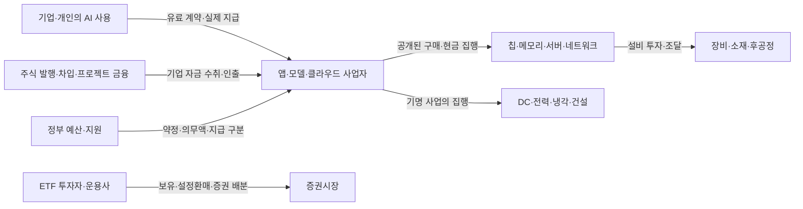

# 공개 자료로 보는 반도체의 수요 근거·투자 경로·위험 시나리오

기준일 **2026-10-07**. 상태 **연구 후보·조건부 구조 분석**. 목표는 반도체가 해결해 온 문제, 공개된 성과, 다음 개발·투자 경로와 경로를 바꾸는 신호를 설명하는 것이다. SK하이닉스의 영업·마케팅·상품기획·신제품사업화 학습에 사용한다. 공개되지 않은 고객별 주문량·GPU 이용률·원가·수율·안전재고·공급 배정은 이번 과제에서 제외하며 확보될 때까지 구조 이해를 미루지 않는다.

## 필요했던 이유와 성과를 구분하기

반도체는 계산·기억·저장·통신·감지·전력 변환을 담당한다. AI가 유일한 수요 원인은 아니다. PC·모바일·서버·차량·산업·통신의 서로 다른 사용 목적과 제품 분류는 [거시 구조](semiconductor_macro_structure.md)를 재사용한다. 아래는 전체 기술사의 연대표가 아닌, 메모리 중심으로 읽을 문제와 대표 증거다.

| 필요했던 문제 | 연결되는 제품·기능 | 성과를 확인할 공개 근거 / 해석 범위 |
| --- | --- | --- |
| 소프트웨어와 데이터를 처리하고 실행 중 작업을 보관 | CPU·로직, DDR/LPDDR, NAND/SSD | 시스템 제품·지원 구성·최종시장 통계. 계산용 메모리와 영구 저장장치의 기능·단위를 분리 |
| 병렬 계산과 모델 학습·추론 처리 | GPU/AI ASIC, 빠른 메모리·연결 | [Transformer 2017 논문](https://arxiv.org/abs/1706.03762v1)의 번역 과제는 품질·병렬 처리·훈련 시간의 기술 성과 사례. GPU·AI 산업 전체의 시작이나 상업 ROI를 이 한 논문에 귀속하지 않음 |
| 연산기에 필요한 데이터를 용량·대역폭·지연 조건에 맞춰 공급 | HBM·플랫폼별 호스트 DRAM·패키징 | [GB300 사례](customer_product_cards/hbm_nvidia_gb300.md)의 사양·하이닉스 적용 발표와 별도 시스템 출하 사건. 최대 사양·전시·인증·상업 출하는 각각 구분 |
| 추론의 KV를 저장·재사용하면서 여러 요청 처리 | HBM의 KV, host memory, 조건부 보조 저장 계층 | [PagedAttention 2023](https://arxiv.org/abs/2309.06180v1)의 serving 시험은 메모리 효율 개선 근거. 모델·업무·품질·지연 목표를 고정한 기술 성과이며 신규 메모리 구매량의 증거는 아님 |
| 데이터·체크포인트·검색·장기 보관과 I/O | NAND/eSSD, 컨트롤러·소프트웨어·네트워크 | [AI–메모리 연결](ai_technology_memory_links.md)의 Solidigm/VAST 사례와 조건별 시험. 저장 용량·지연·내구·전력·시스템 가치가 다르며 모든 추론에서 SSD 효과가 같지 않음 |

‘주력’은 **어느 회사·제품군·시스템·기간에서 무엇을 기준으로 하는가**를 붙여 쓴다. 기술 시험의 성과, 플랫폼 채택, 판매 실적, 고객의 수익성은 별도로 확인한다. [NVIDIA FY2026 발표](https://nvidianews.nvidia.com/news/nvidia-announces-financial-results-for-fourth-quarter-and-fiscal-2026)(2026-02-25)는 Data Center 매출과 전사 영업이익이 실현된 상업적 사례다. GPU 플랫폼의 판매 성과를 HBM 매출·특정 메모리 공급 비중·모든 AI 고객의 ROI로 환산하지 않는다. 이 발표를 10월 현재의 최신 회사 실적으로 표시하지 않는다. 하이닉스·삼성의 공개 bit/ASP·재고·투자 관측은 [2026Q2 표](memory_observation_panel_2026q2.md)에 있으며 제품별 내부 원가·배정 분석은 제외한다.

## 실제 확인한 성과·집행·증권 배분

공개 관측을 연결하면 **계산·메모리의 성능/효율 → 플랫폼의 판매 → 공급자의 제품·설비 대응 → 투자자의 산업 배분**이라는 조사 경로가 생긴다. 아래는 그 경로의 서로 다른 지점에서 확보한 사례다. 인과나 동일 자금의 이동을 입증한 연속 거래는 아니다.

| 관측 기간·원문 | 실제 확인한 결과 | 제품·산업과 이어 볼 질문 |
| --- | --- | --- |
| PagedAttention v1, 2023-09-12 [논문 초록](https://arxiv.org/abs/2309.06180v1) | 논문은 FasterTransformer·Orca 등과 비교한 시험에서 같은 지연 수준으로 처리량 **2–4배** 개선을 보고 | 같은 장비에서도 메모리 관리로 성과가 달라질 수 있음. 요청당 효율과 전체 요청 증가를 함께 봐야 함 |
| NVIDIA FY2026, 2026-01-25 종료·02-25 발표 [회사 실적](https://nvidianews.nvidia.com/news/nvidia-announces-financial-results-for-fourth-quarter-and-fiscal-2026) | Data Center 연간 매출 **1,937억 달러**, 전년 대비 **68% 증가** | 가속 컴퓨팅 플랫폼의 상업적 성과 사례. 어떤 플랫폼·메모리·네트워크의 요구가 뒤따르는지는 각각 공식 구성을 확인 |
| SK hynix 2026Q2, 07-29 발표 [기존 관측표](memory_observation_panel_2026q2.md) | DRAM 비트 QoQ **한자릿수 후반**, ASP **약 30%** 증가; NAND 비트 **10%대 중반**, ASP **50%대 중반** 증가 | DRAM·NAND 모두 판매 물량과 평균가격의 움직임이 관측됨. 상품 믹스·플랫폼 요구를 함께 보며 HBM만의 수요로 합치지 않음 |
| SK hynix FY2026 계획과 Q2 현금 취득 [같은 관측표](memory_observation_panel_2026q2.md) | 연간 투자 계획 **40조원대 후반**; Q2 현금흐름표의 유형자산 취득 **10조 6,710억원 유출** | 미래 공급 준비와 현재 지출의 서로 다른 관측. 같은 시설의 장비 인수·설치·가동 사건을 다음에 대조할 이유가 됨 |
| BAI holdings **2026-10-01 기준**, 10-05 접근 기록 [기존 파일 영수증](../../../data/research/api_signal_feasibility/2026-10-05/finance_macro_etf.json), `ishares-bai` | 파일의 비중: **MU 6.68%**, **AMD 5.39%**, **NVDA 5.24%**, **TSM 4.65%**, **LRCX 4.29%** | 메모리·가속기·파운더리·장비 기업을 함께 보유한 실제 증권 배분 사례. 기업별 역할은 [산업 구조](semiconductor_macro_structure.md)와 연결하고 다음 시점의 같은 항목으로 변화 여부를 확인 |

기술 시험·판매·계획·현금 지급·증권 보유는 서로 다른 측정이다. 회사 전체의 매출/ASP·투자에서 제품별 이익·생산량을 역산하지 않는다. BAI는 기존에 확보한 단일 날짜의 CSV를 다시 확인한 예시이며, 현재 비중·매수 변화·자금 유입이나 선행성의 계산 결과가 아니다.

## 앞으로 이어 볼 개발 경로와 산업

| 공개적으로 탐색할 경로 | 함께 볼 산업·실제 역할의 예 | 변화에 따라 확인할 것 |
| --- | --- | --- |
| 가속기·메모리·패키지 공동 진화 | NVIDIA/AMD/AWS 등의 GPU·ASIC 플랫폼, SK hynix·경쟁 메모리 업체, TSMC·후공정·검사 | 용량/대역폭·전력·인터페이스, 제품 세대와 인증·출하 단계. 특정 플랫폼의 공급사를 다른 세대에 자동 승계하지 않음 |
| 긴 입력·추론·에이전트와 메모리 계층 | serving software, 클라우드/OEM, HBM·host DRAM·저장·네트워크 | 실제 입력/출력·동시성·품질/지연 조건, prefix 공유와 계층 배치. 발표된 최대 context와 실제 사용을 구분 |
| 효율과 대체 구조 | PagedAttention·prefix caching, GQA/MLA·KV 압축, SSM/hybrid, 소형·업무 특화 모델 | 같은 품질/지연에서 어떤 자원 요구가 감소·이동하는가. 논문 → backend 지원 → 실제 제품 통합 → 사용 → 상업 성과를 별도로 확인 |
| 물리적 인프라 확장 | 전력회사·계통·송전/변압기·전력 변환·냉각·건설, 광통신·네트워크 | 사업 계획·허가·자금·장비 인수·통전의 공개 단계. 전력 공급이 준비돼도 AI 사용·메모리 주문은 별도 관측 |
| 최종 사용의 확산 또는 정체 | 기업 소프트웨어·클라우드, 금융·의료·로봇·차량·산업 | 유료 제품·도입·사용·공개 수익성, 지원 플랫폼과 시스템 구성. 한 업종의 AI 채택 비율을 HBM 비트 수요로 환산하지 않음 |
| 공급 지역·소재·장비의 경로 변경 | 정제·웨이퍼·가스·공정재료·장비·물류, 정부 규칙·승인 | 원소보다 형태·등급·공정·부품·지역·시행 조건을 먼저 확인. 다른 나라의 광산 증설이 반도체급 재료 공급 완료를 뜻하지 않음 |
| 항공우주·방위·우주 연산의 분기 | RF·우주 전원·신뢰성 시험·임무 시스템, 기명 조달 주체 | 기존 제품의 임무 요구와 새로운 우주 연산 구상을 분리. [산업 경로](semiconductor_industry_transmission_routes.md)의 제품 용도를 기명 임무 채택으로 승격하지 않음 |

새 메모리 계층 HBF 등은 [기존 AI 자료](ai_technology_memory_links.md)의 규격·생태계 사건으로 유지한다. 제안된 규격, 연구 성능과 고객 양산 채택은 서로 다른 진행 단계다.

## 신뢰할 자료가 실제로 겨냥하는 대상

| 원자료·발간 시점 | 분석 대상·타겟 | 우리에게 주는 질문 / 경계 |
| --- | --- | --- |
| [IEA Key Questions on Energy and AI](https://www.iea.org/reports/key-questions-on-energy-and-ai), 2026-04-16 | 전력 수요·계통/장비·자금·에너지 안보·비용·정책 | 효율·사용 확산·새 업무가 함께 변하고 금융 여건이 DC 실행을 바꿀 수 있음. 기관의 전망은 회사별 확정 주문이 아님 |
| [IEA Energy and AI의 시나리오](https://www.iea.org/reports/energy-and-ai/energy-demand-from-ai), 2025-04-10 | Lift-Off·High Efficiency·Headwinds와 물리적 공급 제약 | 성장·효율·둔화 경로를 동시에 준비하는 기존 설계 사례. 2025 전망을 2026 실적으로 바꾸지 않음 |
| [iShares 2026 Thematic Mid-Year Update](https://www.ishares.com/us/insights/portfolio-insights/thematic-investing-mid-year-2026-outlook-ai-economy), 2026-08-24 | AI 구축과 활용, 칩·전력·소재·로봇·의료·우주/방위의 투자 기회 | 운용사의 **투자 타겟 이동**을 탐색. 3자 전망·비용 추계와 실측을 구분하고 상품 판매·운용 관점도 기록 |
| [BAI 공식 상품 설명](https://www.ishares.com/us/products/339081/ishares-a-i-innovation-and-tech-active-etf), 10-07 조회·각 항목 as-of 별도 | 인프라·intelligence·apps/services의 액티브 증권 배분 | 실제 보유와 상품 목표를 따로 읽음. 보유 수·NAV·가격·좌수의 기준일이 다를 수 있고 IBOR와 NAV 평가 기준도 다름 |
| [USGS MCS 2026](https://pubs.usgs.gov/periodicals/mcs2026/mcs2026-gallium.pdf), 최초 2026-02-06·소재별 개정 보존 | 국가별 소재 용도·생산 단계·교역·의존 구조 | 가격/등급과 광산·정제·재료를 구분하는 공급 노출의 배경. 회사 매수 의견·현재 특정 업체 부족으로 읽지 않음 |
| [Census BTOS 설명](https://www.census.gov/library/stories/2026/05/ai-use-businesses.html), 2026-05-26 | 미국 기업의 최근 2주 AI 사용과 향후 6개월 예상 사용, 업종/규모 | 현재 사용·도입 의향을 구분. 2025-11-17 문항 변경 전후의 단순 비교 금지. 유료 토큰·장비 구매·ROI의 직접 관측은 아님 |

2026년 자료라는 이유만으로 모든 내용이 현재 실측은 아니다. 기관별 대상·모집단·발간일·관측기간과 전망을 보존한다. 운용사의 투자 타겟, 정책 기관의 위험 분석, 개발자의 기술 시험이 같은 결론을 내렸다고 합산하지 않는다.

## 돈은 어떤 경로로 움직이는가

화살표는 분류할 경로이며 현재 특정 거래의 금액이나 인과를 확인한 그림이 아니다. 공개된 계약·공시로 같은 거래가 확인될 때만 실제 상대방을 붙인다. 증권시장의 ETF 거래와 발행기업의 신규 조달·고객 현금·설비 지급은 별도로 기록한다. [SEC ETF 구조 설명](https://www.investor.gov/introduction-investing/general-resources/news-alerts/alerts-bulletins/investor-bulletins-24)에 따라 현물 설정/환매도 구분하며, 같은 자금을 여러 층에서 합산하지 않는다.

## 어떤 시그널을 무엇보다 먼저 확인할 것인가

| 목적 | 공개 수집 대상·필드 / 무료 경로 | 변화 뒤 확인할 것 |
| --- | --- | --- |
| 투자자가 어느 제품·섹터로 이동하는가 | 액티브 ETF의 공식 holdings CSV·factsheet·prospectus: fund/security ID, as-of, 수량·비중·가격/FX·현금·NAV·좌수·전략 변경. **파일/웹이며 새 API를 확보한 상태는 아님** | 가격·펀드 규모·기업행동·리밸런싱을 구분. 동일 날짜의 좌당 보유량도 설정 바스켓 효과가 남으므로 순수 운용 확신으로 판정하지 않음 |
| 투자 상품이 어떤 기회를 새로 겨냥하는가 | 운용사의 ETF 출시·전략/지수 변경·정식 문서, 목표 기업/활동·active/passive·레버리지/옵션 규칙·공개일 | 상품 출시의 테마와 실제 보유·투자자 설정을 대조. 패시브 편입·옵션 전략의 기계적 거래와 산업 판단을 구분 |
| 고객의 수익·투자 의지가 실행되는가 | IR/공시의 회사·세그먼트 수익·현금, CAPEX 계획/수정·실제 현금 취득·리스, 공개 조달/계약 | 클라우드 총매출과 AI 전용 매출을 구분. 메모리 구매액·내부 ROI로 배분하지 않고 집행·가동 사건과 교차 확인 |
| AI 활용이 넓어지거나 둔화하는가 | BTOS 공식 설명·공개 표/다운로드의 current/expected use, 업종·규모·관측기간·문항 버전. 데이터 행/API 수집은 미실행 | 도입 의향과 실제 사용의 차이·정의 변경·표본 불확실성을 확인. 사용 기업 비율만으로 연산량을 계산하지 않음 |
| 다음 상품의 요구가 바뀌는가 | 공식 모델 config/model card·논문·backend release와 제품 지원표: 구조·KV heads/압축·dtype·실행 설정·지원 단계·문서/commit | 같은 품질·입출력 길이·동시성·지연 목표에서 peak 메모리·prefill/decode·계층 I/O를 비교. 시험과 실제 서비스 구매는 구분 |
| 물리적 위험이 공급·일정을 바꾸는가 | USGS 형태별 국가 통계, 같은 품목의 기존 무료 무역 경로, 공식 규칙·기업 시설/조달·전력/허가 사건 | 소재 형태·순도·공정과 원산지/정제·운송 경로를 먼저 확인. 표/HS/조정·개정 계약이 정해진 범위만 비교 |
| 상품의 상업적 실행이 달라지는가 | 회사 bit/ASP·제품 믹스 설명, 공개 인증·출하·설비 인수·가동 사건 | 가격·재고·믹스와 최종 수요를 대조. bit/ASP 범위는 원문 표현을 유지하고 내부 물량·수율을 역산하지 않음 |

ETF의 일별 공개나 원자재 가격의 빠른 변동은 **탐색의 속도**다. ‘선행’은 무엇의 인증·출하·투자·가동보다 앞서는지 정하고 당시 공개된 정보로 대조해야 한다. 원자재 가격도 형태·순도·지역·평가 기준·거래 범위를 확인한다. 연간 USGS 인용 가격·수입 평균단가를 실시간 가격 API 또는 반도체급 공정재료 가격으로 자동 해석하지 않는다. 이번에는 선행 기간·신호 순위·ETF flow를 계산하지 않았다.

## 가정이 바뀔 때의 준비

다음은 조건부 시나리오다. 현재 발생·확률·피해 규모 또는 특정 기업의 최적 전략을 판정한 결과가 아니다. ‘준비’는 공개 근거로 비교할 대안과 재검토할 질문이다.

| 가정 | 영향을 조사할 경로·상품 | 반전·대체 설명 | 공개 신호와 준비 선택지 |
| --- | --- | --- | --- |
| **S1 지정학·전쟁·통제·물류로 공급 경로가 끊김** | 국가/항로 → 해당 형태의 소재·장비·에너지 → 공정/부품·시설 일정. 갈륨/RF·전력, 게르마늄/광연결, 반도체급 실리콘 등 경로별 분리 | 실제로 쓰는 등급·경로가 다름, 공개된 대체 조달·재활용·생산 전환이 실행됨. 사건 뉴스만으로 메모리 공급 중단을 확정하지 않음 | 공식 규칙/중단·기명 조달/시설의 일정 수정·같은 품목 교역. 다른 공급 지역·대체 소재/제품·검증/인증 시간·운송 경로를 비교하고 현재 가능한 대안과 개발안을 나눔 |
| **S2 긴 context·KV 요구와 실제 사용이 계속 확대** | 실제 input/output·동시성 → resident 메모리/대역폭·지연 요구 → HBM·host memory·조건부 저장/연결 요구 | 최대 context만 늘고 실제 사용은 정체, prefix reuse·압축·기존 설비 활용으로 신규 요구가 줄거나 이동 | 모델 구조·backend·동일 품질/지연 시험·공개 서비스 채택. 대역폭·용량·전력·계층 I/O 중 고객 문제를 나눠 상품 가치 설명을 준비. ‘고질적 문제=지속 신규 발주’로 고정하지 않음 |
| **S3 효율 개선과 계층 재배치가 빨라짐** | paging·prefix reuse·GQA/MLA·KV 정밀도·offload → 요청당 자원과 HBM/host/storage 역할 변화 | 품질·지연 손실, prefix hit 낮음, 전송 비용 큼. 절감으로 더 많은 요청을 처리하면 총 요구는 다시 늘 수 있음 | 같은 설정의 품질·TTFT/ITL·동시성·메모리/I/O·지원표. HBM·DRAM·eSSD의 대체/보완 조건을 비교. filesystem tier 지원을 SSD 채택·active KV의 HBM 완전 대체로 쓰지 않음 |
| **S4 AI 회의론·수익성/자금 압박이 실제 투자를 늦춤** | 유료 사용·수익/현금·금융 여건 → 투자 수정/취소·설치 일정 → 서버/메모리/전력 장비의 상업 경로 | 주가·ETF만 조정되고 실제 사용·집행은 유지, 전력 등 공급 제약이 지연 원인, 다른 최종시장으로 투자 이동 | 공식 수익/현금·CAPEX 수정·공개 취소/가동과 ETF 배분을 대조. 확대·유지·연기 시나리오를 함께 읽고 AI 외 서버·모바일·PC·산업 수요를 별도 확인. 내부 고객 ROI의 추정을 전제로 하지 않음 |
| **S5 새 모델·가속기·제품이 기존 역할을 바꿈** | SSM/hybrid·특화 모델/ASIC·신규 메모리 계층 → 같은 과제의 계산/메모리·플랫폼 구성 → 제품 요구 | 연구 성능이 대표 과제 품질·지연을 못 충족, backend 지원/통합/실사용이 없음. hybrid에는 attention KV와 state가 함께 남음 | 논문·지원 코드/설정·기명 통합·제품/규격·채택 단계. 기존 상품의 역할이 줄어드는 조건과 새 인터페이스·용량·품질 요구를 비교. 발표만으로 HBM/DRAM/SSD 퇴출을 예상하지 않음 |

소재의 적용도 [USGS 갈륨](https://pubs.usgs.gov/periodicals/mcs2026/mcs2026-gallium.pdf)·[게르마늄](https://pubs.usgs.gov/periodicals/mcs2026/mcs2026-germanium.pdf)·[실리콘](https://pubs.usgs.gov/periodicals/mcs2026/mcs2026-silicon.pdf)·[희토류](https://pubs.usgs.gov/periodicals/mcs2026/mcs2026-rare-earths.pdf)의 원 단계로 확인한다. 저순도 갈륨과 고순도 정제·GaAs 웨이퍼, bulk 실리콘과 반도체급 polysilicon/웨이퍼, REO 환산 광산 생산과 분리 원소/자석은 다르다. 특정 메모리 공정이나 장비의 투입재로 붙일 때는 공개 공정·제품 근거가 필요하다. 해당 근거가 없으면 구조상 인접 산업에 대한 노출로 제한하며 내부 자료 수집을 다음 과제로 만들지 않는다. USGS 2026의 최초 게시 02-06과 희토류의 v1.3 재게시 05-27은 [공식 개정 이력](https://pubs.usgs.gov/periodicals/mcs2026/versionHist.txt)으로 구분했다.

S3의 [MLA 논문](https://arxiv.org/html/2405.04434v5)은 2024년 모델 구조/시험의 근거다. [prefix caching 문서](https://docs.vllm.ai/en/latest/features/automatic_prefix_caching/)는 공통 입력의 재사용이며 새 토큰 생성 시간 감소를 보장하지 않는다. [offload 문서](https://docs.vllm.ai/en/latest/features/kv_offloading_usage/)에서 offload된 완료 KV blocks 중 재사용에 필요한 cache hits는 GPU로 다시 올라오고 기본 `offload_prompt_only=true`에서는 decode blocks를 제외한다. S5의 [Mamba v2](https://arxiv.org/html/2312.00752v2)는 순수 SSM의 추론 state 구조를 보여 주며 가중치·훈련·working memory의 제거를 뜻하지 않는다. 최신 문서의 표시일은 release/commit이 아니므로 실제 비교에서는 모델·backend·hardware·설정을 고정한다.

## 기록과 다음 검토

시그널을 보면 **당시 공개 근거 → 어떤 제품·단계를 언제 바꿀 것이라는 조건부 예상 → 뒤에 확인한 같은 대상의 실제 → 다른 설명/정의/시차 → 유지·수정·보류 이유**를 기존 연구 기록에 남긴다. 맞은 사례뿐 아니라 반론·실패·미관측도 보존한다. 산업의 강화 루프는 사용·수익·투자·능력이 다시 사용으로 이어지는 조건을 확인하고, 재고·가격·효율·자금·전력의 균형 경로도 함께 본다. 이번 문서 작성은 이 반복 평가나 실증의 실행 결과가 아니다.

새 출처의 URL·역할·발간/조회 시점·짧은 발췌·locator·응답 hash와 접근 상태는 [출처 영수증](../../../data/research/structural_market_scenarios/2026-10-07/sources.json)에 둔다. 기존 연구 원문·JSON과 H1 Gate 6 대기·결과 계산 금지 상태를 유지한다. 새 수집기·점수·DB·runtime은 추가하지 않았다.

**다음 검토 하나:** [지표 목적 문서](indicator_collection_purpose.md)에 따라 기존 NVIDIA CMX 사례의 공개 요구·메모리 계층·지원/채택 단계와 운용사 타겟을 대조한다. ETF 변화가 제품의 실제 상업 경로를 설명하는지부터 확인하며 내부 주문량은 제외한다. KOSIS는 회사 설명과 산업 실행의 비교 질문이 생길 때 수행할 조건부 보조 작업으로 둔다.
